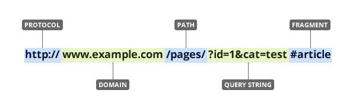

```{r, include=FALSE, echo=FALSE}
require(knitr)
knitr::opts_chunk$set(eval=FALSE, results=TRUE, message=FALSE, warning=FALSE, error=FALSE, python.reticulate=TRUE)
# knitr::opts_chunk$set(eval=TRUE, results=TRUE, message=FALSE, warning=FALSE, error=FALSE, engine.path="c:\\Python37-x64")
require(reticulate)
use_condaenv(condaenv="r-reticulate", required=TRUE)
```

# Concepts
We start with the basic concepts that are generic to all web scraping approaches.

## How does the web work?

### Components

Computers connected to the web are called **clients** and **servers**. A simplified diagram of how they interact might look like this:


* **Clients** are the typical web user's internet-connected devices (for example, your computer connected to your Wi-Fi) and web-accessing software available on those devices (usually a web browser like Firefox or Chrome).
* **Servers** are computers that store webpages, sites, or apps. When a client device wants to access a webpage, a copy of the webpage is downloaded from the server onto the client machine to be displayed in the user's web browser.
* **HTTP** is a language for clients and servers to speak to each other.

### So what happens?

When you type a web address into your browser:

1. The browser finds the address of the server that the website lives on.
2. The browser sends an **HTTP request message** to the server, asking it to send a copy of the website to the client. 
3. If the server approves the client's request, the server sends the client a `200 OK` message, and then starts displaying the website in the browser.

## Uniform Resource Locator (URL)
To retrieve information from the website (i.e., make a request), we need to know the location of the information we want to collect. The Uniform Resource Locator (URL) --- commonly know as a "web address", specifies the location of a resource (such as a web page) on the internet.

A URL is usually composed of 5 parts:



The 4th part, the "query string", contains one or more **parameters** --- in this case, there are two parameters: `id` and `cat`. The 5th part, the "fragment", is an internal page reference and may not be present.

It is often convenient to create variables containing the domain(s) and path(s) you'll be working with, as this allows you to swap out paths and parameters as needed. Note that the path is separated from the domain with a forward slash `/` and the parameters are separated from the path with a question mark `?`. If there are multiple parameters they are separated from each other with an ampersand `&`.

## Document Object Model (DOM)

To parse HTML, it is convenient to represent our HTML document as a tree-like structure that contains information in **nodes** and links information through **branches**. This tree-like structure is called the **Document Object Model (DOM)**. DOM is a cross-platform and language-independent interface that treats an XML or HTML document as a tree structure wherein each node is an object representing a part of the document. *Each branch of the tree ends in a node, and each node contains objects*. DOM methods allow programmatic access to the tree; with them one can change the structure, style or content of a document. The following is an example of DOM hierarchy in an HTML document:


**WE NEED AN ACTUAL EXAMPLE OF THE DOM IN HTML CODE:**

Explain what a <div> element is, what a <td> element is etc.

```
<tr id=students_school_row>
    <td class=w2p_fl>
        <label for="students_school" id="students_school_label">
            School:
        </label>
    <td class=w2p_fw>IV
```

```
<html>
    <body>
        <div id="result"></div>
        <script>
                document.getElementById("result").innerHTML = 
            `<table>
                    <tr>
                        <th>Name</th>
                        <th>Grade</th>
                        <th>GPA</th>
                    </tr>
                    <tr>
                        <td>Adams</td>
                        <td>5</td>
                        <td>4</td>
                    </tr>
                    <tr>
                        <td>Alexander</td>
                        <td>5</td>
                        <td>1</td>
                    </tr>
                    <tr>
                        <td>Aaron</td>
                        <td>5</td>
                        <td>3</td>
                    </tr>
                    <tr>
                        <td>Aws</td>
                        <td>5</td>
                        <td>3.5</td>
                    </tr>
                    <tr>
                        <td>Alan</td>
                        <td>5</td>
                        <td>2</td>
                    </tr>
                </table>
            `;
        </script>
    </body>
</html>
```