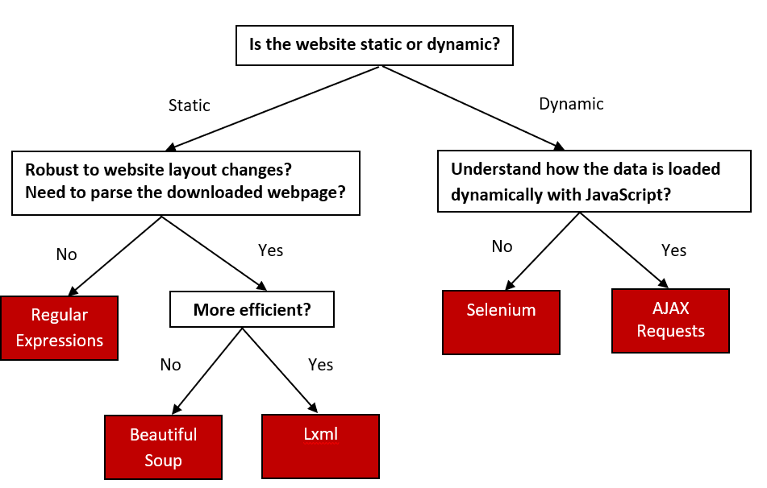

```{r, include=FALSE, echo=FALSE}
require(knitr)
knitr::opts_chunk$set(eval=FALSE, results=TRUE, message=FALSE, warning=FALSE, error=FALSE, python.reticulate=TRUE)
# knitr::opts_chunk$set(eval=TRUE, results=TRUE, message=FALSE, warning=FALSE, error=FALSE, engine.path="c:\\Python37-x64")
require(reticulate)
# use_condaenv(condaenv="r-reticulate", required=TRUE)
```

# Web Scraping Approaches

## Decision tree
There are many commonly used web scraping approaches. This decision tree will help us to decide upon the best approach to use for a particular web site.



If the content we are viewing in our browser does not match the content we see in the HTML source code we are retrieving from the site, then we are encountering a dynamic website. Otherwise, if the browser and source code content match each other, the website is static. A mismatch of content would be due to the execution of JavaScript that changes the HTML elements on the page. **Using the Chrome browser, we can view the original HTML via `View page source`. We can view the revised HTML in our browser if it executes JavaScript in the `Elements` window via `Inspect` the web page.**

## Static web pages
There are three approaches to extracting data from a static webpage that has been downloaded. We can use:

1. Regular expressions
2. Beautiful Soup Python module
3. lxml Python module

We use this [static student profile webpage](https://iqssdss2020.pythonanywhere.com/tutorial/static/views/Adams.html) to provide examples for each approach. Suppose that we want to scrape a student name. The data we are interested in is found in the following part of the HTML. The student name is included within a `<td>` element of `class="w2p_fw"`, which is the child of a `<tr>` element of `ID students_name_row`. 

```
<table>
    <tr id="students_name_row"><td class="w2p_fl"><label for="students_name" id="students_name_label">Name:</label></td><td class="w2p_fw">Adams</td>
        <td class="w2p_fc"></td>
    </tr>
    <tr id="students_school_row"><td class="w2p_fl"><label for="students_school" id="students_school_label">School:</label></td><td class="w2p_fw">IV</td>
        <td class="w2p_fc"></td>
    </tr>
    <tr id="students_level_row"><td class="w2p_fl"><label for="students_level" id="students_level_label">Advanced:</label></td><td class="w2p_fw">No</td>
        <td class="w2p_fc"></td>
    </tr>
</table>
```

### Regular expressions
Regular expressions (regex) directly work on a downloaded web page, without any need to parse the page into a certain format. We can use regex to match the content we want to extract from the HTML. There is a thorough overview of regex [here](https://docs.python.org/3.8/howto/regex.html). In this example, we need to match the `<td class="w2p_fw">` tag to scrape the student name. But this tag is used for multiple student profile attributes. To isolate the name, we select the first element, as shown in the code below: 

```{python}
import re
import requests

url = 'https://iqssdss2020.pythonanywhere.com/tutorial/static/views/Adams.html'
html = requests.get(url)
mylist = re.findall('<td class="w2p_fw">(.*?)</td>', html.text)
print(mylist)

name = re.findall('<td class="w2p_fw">(.*?)</td>', html.text)[0]
print(name)
```

This solution works, but can easily fail if the web page is updated later. Consider if the student ID data is inserted right before the student name. Then we must change the code to select the second element. The general solution to make a regular expression scraper more robust is to include the parent element, which has an `ID`, so it ought to be unique:

```{python}
mylist = re.findall('<tr id="students_name_row"><td class="w2p_fl"><label for="students_name" id="students_name_label">Name:\
</label></td><td class="w2p_fw">(.*?)</td>', html.text)
```

This solution is better. However, there are many other ways the web page can be updated that still break the regex. For example, double quotation might be changed to single quotation for class name, extra space could be added between the `<td>` tags, or the `students_name_label` could be changed. The general solution for this is to make the regex as generic as possible to support various possibilities:

```{python}
mylist = re.findall('<tr id="students_name_row">.*?<td\s*class=["\']w2p_fw["\']>(.*?)</td>', html.text)
```

This regex is more robust to webpage updates but is more difficult to construct, becoming even unreadable. But still, there are other minor layout changes that would break it, such as if a title attribute is added to the `<td>` tag. From this example, we can see that regex provide a quick way to scrape data without the step of parsing, but are too brittle and will easily break when a web page is updated.

### Beautiful soup
Beautiful Soup is a popular Python module that parses a downloaded web page into a certain format and then provides a convenient interface to navigate content. The official documentation of Beautiful Soup can be found [here](http://www.crummy.com/software/BeautifulSoup/bs4/doc/). The latest version of the module can be installed using this command: `pip install beautifulsoup4`.

The first step with Beautiful Soup is to parse the downloaded HTML into a "soup document". Beautiful Soup supports several different parsers. Parsers behave differently when parsing web pages that do not contain perfectly valid HTML. For example, consider this HTML syntax of a table entry with missing attribute quotes and closing tags for the table row and table fields:

```
<tr id=students_school_row>
    <td class=w2p_fl>
        <label for="students_school" id="students_school_label">
            School:
        </label>
    <td class=w2p_fw>IV
```

Beautiful Soup with the `lxml` parser can correctly interpret the missing attribute quotes and closing tags, as well as add the `<html>` and `<body>` tags to form a complete HTML document, as the code below shows:

```{python}
from bs4 import BeautifulSoup

broken_html = '<tr id=students_school_row><td class=w2p_fl><label for="students_school" id="students_school_label">School:</label><td class=w2p_fw>IV'
soup = BeautifulSoup(broken_html, 'lxml')
fixed_html = soup.prettify()
print(fixed_html)
```

But if we use the `html.parser`, it interprets the school name itself as a child of the school key instead of the parallel table fields and it does not create a complete HTML document, as the code below shows:

```{python}
soup = BeautifulSoup(broken_html, 'html.parser')
```

However, keep in mind that none of these parsers represent a universal solution to the problem of invalid HTML. Solutions will have to be found on case-by-case basis. The next step of using Beautiful Soup is to navigate to the elements of HTML we want using its application programming interface (API). Here is an example to extract the student name from our example profile webpage:

```{python}
from bs4 import BeautifulSoup
import requests

url = 'https://iqssdss2020.pythonanywhere.com/tutorial/static/views/Adams.html'
html = requests.get(url)
soup = BeautifulSoup(html.text, 'html.parser')
tr = soup.find(attrs={'id':'students_name_row'})
td = tr.find(attrs={'class':'w2p_fw'}) 
name = td.text 
print(name)
```

This code is longer than the regex example, but easier to construct and understand. Also, we no longer need to worry about problems in minor layout changes, such as extra whitespace or tag attributes.

### Lxml
The `lxml` module is a Python wrapper on the top of the C libraries `libxml2` and `libxslt`. It works the same way as Beautiful Soup, but is much faster. Here is the [documentation](https://lxml.de/index.html) for `lxml`. The module can be installed using this command: `pip install lxml`. 

As with Beautiful Soup, the first step of `lxml` is parsing the potentially invalid HTML into a consistent format. Here is an example of parsing the same broken HTML:

```{python}
from lxml import etree, html

broken_html = '<tr id=students_school_row><td class=w2p_fl><label for="students_school" id="students_school_label">School:</label><td class=w2p_fw>IV'
tree = html.fromstring(broken_html)
fixed_html = etree.tostring(tree, pretty_print=True).decode('utf-8')
print(fixed_html)
```

As with Beautiful Soup, `lxml` was able to correctly parse the missing attribute quotes and closing tags, although it did not add the `<html>` and `<body>` tags. Here we use the `lxml.etree` module to formulate a more hierarchical tree structure and then convert it to text via the `tostring()` method to display it. 

After parsing the input, `lxml` has its API to select elements, such as XPath selectors, like Beautiful Soup. Here is an example using the lxml `xpath()` method to extract the student name data:

```{python}
from lxml import etree, html
import requests

static_url = "https://iqssdss2020.pythonanywhere.com/tutorial/static/views/Adams.html"
static_html = requests.get(static_url)
tree = html.fromstring(static_html.text)
name = tree.xpath('//*[@id="students_name_row"]/td[2]')[0].text
print(name)
```

### Comparison of approaches
As shown in the previous sections, Beautiful Soup and `lxml` are more robust to webpage changes than regex. Comparing their relative efficiency, `lxml` and the regex module were written in C, while Beautiful Soup is pure Python. So, `lxml` and regex are much faster than Beautiful Soup. To provide benchmarks for these approaches, here we construct an experiment to run each scraper to extract all the available student profile data 1000 times and record the total time taken by each scraper. We start with importing the packages we need for this task: 

```{python}
import re
from bs4 import BeautifulSoup
from lxml import html
import time
import requests
```

We define a global list variable to specify what fields of the profile data we want to scrape. Here we want to extract all the available profile data.

```{python}
fields = ["name", "school", "level"]
```

Each table row has an ID starting with `students_` and ending with `_row`. Then, the profile data is contained within these rows in the same format - has a `td` tag name and a class name of `"w2p_fw"`. Here is the implementation that uses this information to extract all of the available profile data via regular expressions:   

```{python}
def re_scraper(htmlText):
    results = {}
    for field in fields:
        results[field] = re.findall('<tr id="students_{}_row">.*?<td class="w2p_fw">(.*?)</td>'.format(field), htmlText)[0]
    return results
```

Here is the implementation that uses this information to extract all of the available profile data via Beatiful Soup:

```{python}
def bs_scraper(htmlText):
    soup = BeautifulSoup(htmlText, 'html.parser')
    results = {}
    for field in fields:
        results[field] = soup.find(attrs={'id':'students_{}_row'.format(field)}).find(attrs={'class':'w2p_fw'}).text
    return results
```

Here is the implementation that uses this information to extract all of the available profile data via lxml:

```{python}
def lxml_scraper(htmlText):
    tree = html.fromstring(htmlText)
    results = {}
    for field in fields:
        results[field] = tree.xpath('//*[@id="students_{}_row"]/td[2]'.format(field))[0].text
    return results
```

Now that we have complete implementations for each scraper, we will test their relative performance with the script below. This script will run each scraper 1000 times, check whether the scraped results are as expected, and then print the total time taken. Note the line calling re.purge(); by default, the regular expression module will cache searches and this cache needs to be cleared to make a fair comparison with the other scraping approaches.

```{python}
num_iterations = 1000
static_html = requests.get("https://iqssdss2020.pythonanywhere.com/tutorial/static/views/Adams.html").text
for name, scraper in [('Regular Expressions', re_scraper), ('Beautiful Soup', bs_scraper), ('Lxml', lxml_scraper)]:
    start = time.time()
    for i in range(num_iterations):
        if scraper == re_scraper:
            re.purge()
        result = scraper(static_html)
        assert(result["name"] == "Adams")
        assert(result["school"] == "IV")
        assert(result["level"] == "No")
    end = time.time()
    print('{}: {} seconds'.format(name, end - start))
```

Here are the results from running this script on my computer:


The results, when run on a modest Windows desktop computer, show that Beautiful Soup is much slower than the other two approaches. Regex does not perform the fastest, because we call `re.purge()` in every iteration to clear the cache. The `lxml` module performs much better than the other two, although `lxml` has the additional overhead of having to parse the input into its internal format before searching for elements. When scraping many features from a web page, this initial parsing overhead is reduced and `lxml` becomes even more competitive.

## Dynamic web pages
There are two approaches to scraping a dynamic webpage: 

1. Scrape the content directly from the JavaScript 
2. Scrape the website as we view it in our browser --- using Python packages capable of executing the JavaScript.

### AJAX requests
Because the data are loaded dynamically with JavaScript, to scrape these data, we need to understand how the web page loads the data. Suppose that we want to find all students whose names start with the letter "A" in the fifth grade with page size set at 5 from this [dynamic search form webpage](https://iqssdss2020.pythonanywhere.com/tutorial/cases/search). After we click the `Search` button, open `Fiddler` --— software that can inspect HTTP requests on the computer and can be [downloaded here](https://www.telerik.com/download/fiddler). We will see that an AJAX request is made. Under `Request Headers` in the `Inspector` window, we can find the URL for this search. Under the `Response` window, we can see the response content is in JSON format. They are highlighted in blue in the following figure:


AJAX stands for Asynchronous JavaScript and XML. A dynamic web page works because the AJAX allows JavaScript to make HTTP requests to a remote server and receive responses. This approach works by first accessing the AJAX request responses, and then scraping information of interest from them. The AJAX response data can be downloaded directly. With the URL of the response, we can make a request to the server, scrape the information from the response, and store the scraped information in a spreadsheet, as the following code shows:

```{python}
import requests
import pandas as pd

html = requests.get('https://iqssdss2020.pythonanywhere.com/tutorial/cases/search_ajax?search_name=A&search_grade=5&page_size=5&page=1')
html_json = html.json()
print(html_json)

students_A5p0 = pd.DataFrame.from_records(html_json['records'])
print(students_A5p0.head(10))
```

Here is an example implementation that scrapes all the students by searching for each letter of the alphabet and each grade, and then iterating over the resulting pages of the JSON responses. The results are then stored in a spreadsheet. We start with importing the necessary packages as usual. Next, we prepare for an url with flexibility of allowing the varying input for three parameters - name, grade, and page number. We create an empty list to store all the student records scraped from this website. We hardcode a list of grade levels to control the looping order of the most inner for loop.   

```{python}
import requests
import pandas as pd
import string

temp_url = 'https://iqssdss2020.pythonanywhere.com/tutorial/cases/search_ajax?search_name={}&search_grade={}&page_size=5&page={}'
students = list()
grades = ["K", "1", "2", "3", "4", "5"]
```

With three varying input - name, grade, and page number, we design a nested loops with three levels. For a given name, a given grade, we loop every result page. Because we do not know how many pages of results there are, we use a while loop to loop result pages instead of a for loop. As we loop over this nested structure, we store each student's record to a list. 

```{python}
for letter in string.ascii_uppercase:
    for grade in grades:
        page = 0
        while True:
            url = temp_url.format(letter, grade, page)
            html = requests.get(url)
            html_json = html.json()
            students.extend(html_json["records"])
            page += 1
            if page >= html_json["num_pages"]:
                break
```

Finally, we restore the scraped information from a list of dictionaries into a spreadsheet, as the following code shows:

```{python}
students_df = pd.DataFrame.from_records(students)
print(students_df.head(10))
```

The AJAX-dependent websites initially look more complex but their structure encourages separating the data transmission between client and server and the data presentation on the client browser executing JavaScript, which can make our job of extracting these data much easier.

### Selenium
The second approach to scraping dynamic web pages uses Python packages capable of executing the JavaScript itself, so that we can scrape the website as we view it in our browser. Selenium works by automating browsers to execute JavaScript to display a web page as we would normally interact with it. To illustrate how Selenium can automate a browser to execute JavaScript, we have created a simple [dynamic table webpage](https://iqssdss2020.pythonanywhere.com/tutorial/default/dynamic). This web page uses JavaScript to write a table to a `<div>` element. Here is the source code:

```
<html>
    <body>
        <div id="result"></div>
        <script>
                document.getElementById("result").innerHTML = 
            `<table>
                    <tr>
                        <th>Name</th>
                        <th>Grade</th>
                        <th>GPA</th>
                    </tr>
                    <tr>
                        <td>Adams</td>
                        <td>5</td>
                        <td>4</td>
                    </tr>
                    <tr>
                        <td>Alexander</td>
                        <td>5</td>
                        <td>1</td>
                    </tr>
                    <tr>
                        <td>Aaron</td>
                        <td>5</td>
                        <td>3</td>
                    </tr>
                    <tr>
                        <td>Aws</td>
                        <td>5</td>
                        <td>3.5</td>
                    </tr>
                    <tr>
                        <td>Alan</td>
                        <td>5</td>
                        <td>2</td>
                    </tr>
                </table>
            `;
        </script>
    </body>
</html>
```

With the traditional approach of downloading the original HTML and parsing the result, the `<div>` element will be empty, as follows:

```{python}
from lxml import html
import requests

global_dynamicUrl = "https://iqssdss2020.pythonanywhere.com/tutorial/default/dynamic"
global_dynamicPage = requests.get(global_dynamicUrl)
global_dynamicHtml = html.fromstring(global_dynamicPage.text)
table_area = global_dynamicHtml.xpath('//*[@id="result"]/table')
print(table_area)
```

Here is an initial example with Selenium. Selenium can be installed using `pip` with the command: `pip install selenium`. The first step is to create a connection to the web browser that we use. Next is to load a web page in the chosen web browser by executing the JavaScript. The JavaScript is executed because now the `<div>` element has an object representing a table, and within that object, there are 6 objects representing 6 table entries.

```{python}
from selenium import webdriver

driver = webdriver.Chrome('YOUR_PATH_TO_chromedriver.exe_FILE')
global_dynamicUrl = "https://iqssdss2020.pythonanywhere.com/tutorial/default/dynamic"
driver.get(global_dynamicUrl)
table_area = driver.find_element_by_xpath('//*[@id="result"]/table')
table_entries = table_area.find_elements_by_tag_name("tr")
print(len(table_entries))
driver.close()
```

So far, our browser automation can only execute JavaScript and access the resulting HTML. To scrape the resulting HTML will require extending the browser automation to support intensive website interactions with the user. Fortunately, Selenium has an excellent API to select and manipulate the HTML elements, which makes this straightforward. Here is an example implementation that rewrites the previous example that searches all students in Selenium. We will cover Selenium in detail in the following chapters.

We first define a function called as `fill_in_form_once()` with three parameters – driver object, first letter of a student’s name, and grade.

```{python, eval=FALSE}
def fill_in_form_once(driver, letter, grade):
    driver.find_element_by_xpath('//*[@id="search_name"]').send_keys(letter)
    driver.find_element_by_xpath('//*[@id="search_grade"]/option[{}]'.format(grade)).click()
    driver.find_element_by_xpath('//*[@id="search"]').click()
    time.sleep(5)
    return driver
```

We write down another separate function called as `scrape_table_this_page()` that scrapes all student records in the table on one page.

```{python, eval=FALSE}
def scrape_table_this_page(driver):
    students_this_page = list()
    table = driver.find_element_by_xpath('//*[@id="results"]/table')
    entries = table.find_elements_by_tag_name("tr")
    for i in range(1, len(entries)):
        student_dict = dict()
        cols = entries[i].find_elements_by_tag_name("td")
        student_dict["name"] = cols[0].text
        student_dict["grade"] = cols[1].text
        student_dict["gpa"] = cols[2].text
        students_this_page.append(student_dict)
    return students_this_page
```

Now, we put all these things together and write a complete program. We start with importing the packages needed for the task and going through the set-up procedure. We will talk about the set up procedure in detail in Chapter 4.
```{python}
from selenium import webdriver
import time
import string
import pandas as pd

driver = webdriver.Chrome('YOUR_PATH_TO_chromedriver.exe_FILE')
searchAddress = "https://iqssdss2020.pythonanywhere.com/tutorial/cases/search"
driver.get(searchAddress)
time.sleep(2)
```

We use a double for loop in order to loop over each grade for a given letter and then loop over each letter. In the inner most loop, we call the function `fill_in_form_once()` with a given grade for a given letter, which fills in all the fields of the form and submits it to the server. we use `try` and `except` (the outer pair) to handle the situation when there is no result returned.In either case, when a single search is over, we refresh the search form (`driver.get(searchAddress)`) and go to the next new search. We use a `while` loop to control page turning. Inside this `while` loop, we first scrape all student records in the result table on one page by calling the `scrape_table_this_page()` function, and then append the results on the final list of results. The `while` loop is broken out when it reaches the end of results of a search.  

```{python}
students = list()

for letter in string.ascii_uppercase:
    for grade in range(2,8):
        driver = fill_in_form_once(driver, letter, grade)
        try:
            while True:
                students_this_page = scrape_table_this_page(driver)
                students.extend(students_this_page)
                try:
                    driver.find_element_by_xpath('//*[@id="next"]').click()
                    time.sleep(2)
                except:
                    break
            driver.get(searchAddress)
            time.sleep(2)
        except:
            print("No results for letter {} at grade {}".format(letter, grade - 2))
            driver.get(searchAddress)
            time.sleep(2)
```

Finally, we store the list of final results into a Pandas data frame and close our driver. 

```{python}
students_df = pd.DataFrame.from_records(students)
print(students_df.head(10))
driver.close()
```

### Comparison of approaches
The first approach requires an understanding of how the data is loaded dynamically with JavaScript. This means we must be able to interpret the JavaScript code found in `View page source`. For the example search web page, we were able to easily know how the JavaScript works. However, some websites will be very complex and difficult to understand. With enough effort, any website can be scraped in this way. However, this effort can be avoided by instead using the Python module Selenium, which automates a web browser to execute JavaScript to display a web page and then perform actions on this web page. This approach only requires that we know how Selenium and its APIs work, so that we can control a web browser. You do not need to understand how the backend of a website works. However, there are disadvantages. Automating a web browser adds overhead and so is much slower than just downloading the HTML. Additionally, solutions using a browser driver often require pinging the web page to check whether the resulting HTML from an event has occurred yet or waiting a set amount of time to make sure an AJAX event has completed, which is brittle and can easily fail when the network is slow.
