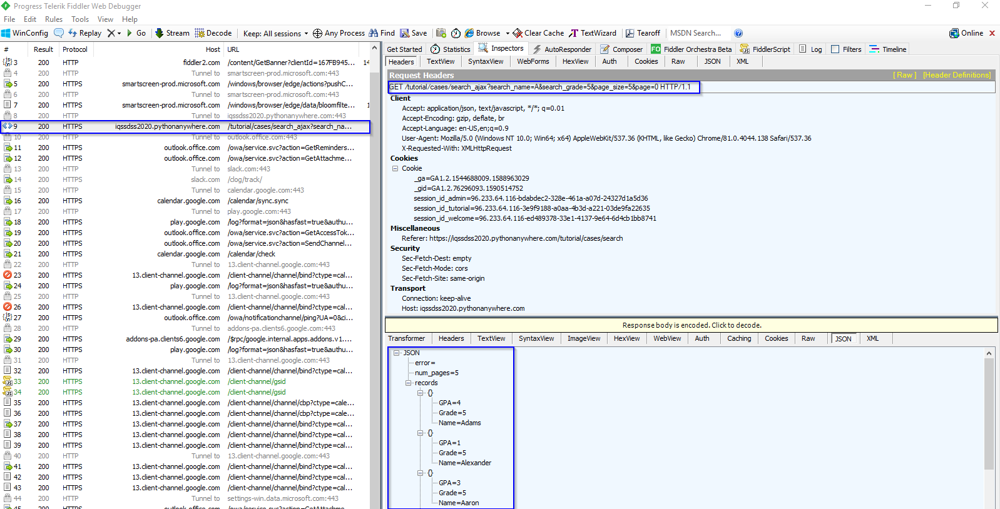

# Approaches to Web Scraping
If the content you are viewing in your browser does not match the content you see in the HTML source code you are retrieving from the site, then you are experiencing the dynamic websites. Otherwise, if they match with each other, the websites are static. The mismatch is due to the execution of JavaScript that changes the HTML elements on the page. You could view the original HTML via **View page source**. You could view the revised HTML in your browser if it executes JavaScript in the **Elements** window via **Inspecting** the web page.

## Approaches to Scraping a Static Web Page
There are three approaches to extracting data from a static webpage that has been downloaded: using regular expressions, using Beautiful Soup module, and finally using lxml module. We use this [static student profile webpage](https://iqssdss2020.pythonanywhere.com/tutorial/static/views/Adams.html) to provide examples for each approach. Suppose that we want to scrape the student name. The data we are interested in is found in this part of the HTML. The student name is included within a `<td>` element of `class w2p_fw`, which is the child of a `<tr>` element of `ID students_name_row`. 

```
<table>
    <tr id="students_name_row"><td class="w2p_fl"><label for="students_name" id="students_name_label">Name:</label></td><td class="w2p_fw">Adams</td>
        <td class="w2p_fc"></td>
    </tr>
    <tr id="students_school_row"><td class="w2p_fl"><label for="students_school" id="students_school_label">School:</label></td><td class="w2p_fw">IV</td>
        <td class="w2p_fc"></td>
    </tr>
    <tr id="students_level_row"><td class="w2p_fl"><label for="students_level" id="students_level_label">Advanced:</label></td><td class="w2p_fw">No</td>
        <td class="w2p_fc"></td>
    </tr>
</table>
```
### Regular Expressions
Regular expressions directly work on a downloaded web page with no need of parsing it into a certain format and try to match the content of the part of the HTML that contains the data you want to scrape from. There is a thorough overview of regular expressions [here](https://docs.python.org/3.8/howto/regex.html). In this example, we need to match the `<td class="w2p_fw">` tag to scrape the student name. But this tag is used for multiple student profile attributes. To isolate the name, we select the first element, as shown in the code below. 

```{python, eval=TRUE}
import re
import requests

url = 'https://iqssdss2020.pythonanywhere.com/tutorial/static/views/Adams.html'
html = requests.get(url)
mylist = re.findall('<td class="w2p_fw">(.*?)</td>', html.text)
print(mylist)

name = re.findall('<td class="w2p_fw">(.*?)</td>', html.text)[0]
print(name)
```
This solution works now but could easily fail if the web page is updated later. Consider if the student ID data is inserted right before the student name. Then we must change the code to select the second element. The general solution to make a regular expression scraper more robust is to include the parent element, which has an `ID`, so it ought to be unique:

```{python, eval=TRUE}
import re
import requests

url = 'https://iqssdss2020.pythonanywhere.com/tutorial/static/views/Adams.html'
html = requests.get(url)
mylist = re.findall('<tr id="students_name_row"><td class="w2p_fl"><label for="students_name" id="students_name_label">Name:\
</label></td><td class="w2p_fw">(.*?)</td>', html.text)
print(mylist)
```

This solution is better. However, there are many other ways the web page could be updated that still break the regular expression. For example, double quotation might be changed to single for class name, extra space could be added between the `<td>` tags, or the name_label could be changed. The general solution to it is to make the regular expression as generic as possible to support various possibilities:

```{python, eval=TRUE}
import re
import requests

url = 'https://iqssdss2020.pythonanywhere.com/tutorial/static/views/Adams.html'
html = requests.get(url)
mylist = re.findall('<tr id="students_name_row">.*?<td\s*class=["\']w2p_fw["\']>(.*?)</td>', html.text)
print(mylist)
```

This regular expression is more robust to webpage updates but is more difficult to construct, becoming even unreadable. But still, there are other minor layout changes that would break it, such as if a title attribute is added to the `<td>` tag. From this example, regular expressions provide a quick way to scrape data without the step of parsing but are too brittle and will easily break when a web page is updated.

### Beautiful Soup
Beautiful Soup is a popular module that parses a downloaded web page into a certain format and then provides a convenient interface to navigate content. The official documentation of Beautiful Soup can be found [here](http://www.crummy.com/software/BeautifulSoup/bs4/doc/). The latest version of the module can be installed using this command: `pip install beautifulsoup4`.

The first step with Beautiful Soup is to parse the downloaded HTML into a soup document. Beautiful Soup supports several different parsers. Parsers behave differently when parsing web pages that do not contain perfectly valid HTML. For example, consider this HTML syntax of a table entry with missing attribute quotes and closing tags for the table row and table fields:

```
<tr id=students_school_row>
    <td class=w2p_fl>
        <label for="students_school" id="students_school_label">
            School:
        </label>
    <td class=w2p_fw>IV
```
Beautiful Soup with the **lxml** parser can correctly interpret the missing attribute quotes and closing tags, as well as add the `<html>` and `<body>` tags to form a complete HTML document, as the code below shows:

```{python, eval=TRUE}
from bs4 import BeautifulSoup

broken_html = '<tr id=students_school_row><td class=w2p_fl><label for="students_school" id="students_school_label">School:</label><td class=w2p_fw>IV'
soup = BeautifulSoup(broken_html, 'lxml')
fixed_html = soup.prettify()
print(fixed_html)
```
But if we use the **html.parser**, it interprets the school name itself as a child of the school key instead of the parallel table fields and it does not create a complete HTML, as the code below shows:

```{python, eval=TRUE}
from bs4 import BeautifulSoup

broken_html = '<tr id=students_school_row><td class=w2p_fl><label for="students_school" id="students_school_label">School:</label><td class=w2p_fw>IV'
soup = BeautifulSoup(broken_html, 'html.parser')
fixed_html = soup.prettify()
print(fixed_html)
```
However, keep it in mind that none of these parsers is always the correct way to handle invalid HTML. It will be case-by-case. The next step of using Beautiful Soup is to navigate to the elements of HTML we want using its API. Here is an example to extract the student name from our example profile webpage:

```{python, eval=TRUE}
from bs4 import BeautifulSoup
import requests

url = 'https://iqssdss2020.pythonanywhere.com/tutorial/static/views/Adams.html'
html = requests.get(url)
soup = BeautifulSoup(html.text, 'html.parser')
tr = soup.find(attrs={'id':'students_name_row'})
td = tr.find(attrs={'class':'w2p_fw'}) 
name = td.text 
print(name)
```

This code is longer than regular expressions but easier to construct and understand. Also, we no longer need to worry about problems in minor layout changes, such as extra whitespace or tag attributes.

### Lxml
The lxml module is a Python wrapper on the top of the C libraries libxml2 and libxslt. It works the same way as Beautiful Soup but is much faster. The documentation of lxml can be found [here](https://lxml.de/index.html). The module can be installed using this command: `pip install lxml`. 

As with Beautiful Soup, the first step of lxml is parsing the potentially invalid HTML into a consistent format. Here is an example of parsing the same broken HTML:

```{python, eval=TRUE}
from lxml import etree, html

broken_html = '<tr id=students_school_row><td class=w2p_fl><label for="students_school" id="students_school_label">School:</label><td class=w2p_fw>IV'
tree = html.fromstring(broken_html)
fixed_html = etree.tostring(tree, pretty_print=True).decode('utf-8')
print(fixed_html)
```
As with Beautiful Soup, lxml was able to correctly parse the missing attribute quotes and closing tags, although it did not add the `<html>` and `<body>` tags. Here we use **lxml.etree** module to formulate a more hierarchical tree structure and then convert it to text via `tostring()` method in order to display it. 

After parsing the input, lxml has its API to select elements, such as XPath selectors, like Beautiful Soup. Here is an example using the lxml `xpath()` method to extract the student name data:

```{python, eval=TRUE}
from lxml import etree, html
import requests

static_url = "https://iqssdss2020.pythonanywhere.com/tutorial/static/views/Adams.html"
static_html = requests.get(static_url)
tree = html.fromstring(static_html.text)
name = tree.xpath('//*[@id="students_name_row"]/td[2]')[0].text
print(name)
```

### Comparison of Approaches
As shown in the previous sections, Beautiful Soup and lxml are more robust to webpage changes than regular expressions. Comparing their relative efficiency, lxml and the regular expression module were written in C, while Beautiful Soup is pure Python. So, lxml and regular expressions are much faster than Beautiful Soup. We did an experiment that ran each scraper to extract all the available student profile data 1000 times and record the total time taken by each scraper. A full implementation of this experiment can be found as follows, as well as the results from running this script on my computer: 

```{python, eval=TRUE}
import re
from bs4 import BeautifulSoup
from lxml import html
import time
import requests

fields = ["name", "school", "level"]

def re_scraper(htmlText):
    results = {}
    for field in fields:
        results[field] = re.findall('<tr id="students_{}_row">.*?<td class="w2p_fw">(.*?)</td>'.format(field), htmlText)[0]
    return results

def bs_scraper(htmlText):
    soup = BeautifulSoup(htmlText, 'html.parser')
    results = {}
    for field in fields:
        results[field] = soup.find(attrs={'id':'students_{}_row'.format(field)}).find(attrs={'class':'w2p_fw'}).text
    return results

def lxml_scraper(htmlText):
    tree = html.fromstring(htmlText)
    results = {}
    for field in fields:
        results[field] = tree.xpath('//*[@id="students_{}_row"]/td[2]'.format(field))[0].text
    return results

num_iterations = 1000
static_html = requests.get("https://iqssdss2020.pythonanywhere.com/tutorial/static/views/Adams.html").text
for name, scraper in [('Regular Expressions', re_scraper), ('Beautiful Soup', bs_scraper), ('Lxml', lxml_scraper)]:
    start = time.time()
    for i in range(num_iterations):
        if scraper == re_scraper:
            re.purge()
        result = scraper(static_html)
        assert(result["name"] == "Adams")
        assert(result["school"] == "IV")
        assert(result["level"] == "No")
    end = time.time()
    print('{}: {} seconds'.format(name, end - start))
```
The results show that Beautiful Soup is much slower than the other two approaches. Regular expressions does not perform the fastest, because we call `re.purge()` in every iteration to clear cache. By default, the regular expression module will cache searches and this cache needs to be cleared to make a fair comparison with the other scraping approaches. lxml performs comparatively well with regular expressions, although lxml has the additional overhead of having to parse the input into its internal format before searching for elements. When scraping many features from a web page, this initial parsing overhead is reduced and lxml becomes even more competitive.

## Approaches to Scraping a Dynamic Web Page
There are two approaches to scraping a dynamic webpage: scrape the content directly from the JavaScript, or use Python packages capable of executing the JavaScript itself, and scrape the website as you view it in your browser.

### AJAX Requests
Because the data is loaded dynamically with JavaScript, to scrape this data, we need to understand how the web page loads this data. Suppose that we want to find all students whose names start with letter A in the fifth grade with page size set at 5 from this [example dynamic web page](https://iqssdss2020.pythonanywhere.com/tutorial/cases/search). After we click **Search** button, open **Fiddler**—a software that can inspect HTTP requests on your computer and can be downloaded [here](https://www.telerik.com/download/fiddler). We will see that an AJAX request is made. Under **Request Headers** in the **Inspectors** window, we can find the URL for this search. Under **Response** window, we can see the response content is in JSON format. They are highlighted in blue in the figure as follows:



AJAX stands for Asynchronous JavaScript and XML. A dynamic web page works because the AJAX allows JavaScript to make HTTP requests to a remote server and receive responses. This approach is to first access to the AJAX request responses, and then to scrape information of interest from them. The AJAX response data can be downloaded directly. With the URL of the response, we can make a request to the server, scrape the information from the response, and store the scraped information in a spreadsheet, as the following code shows:

```{python, eval=TRUE}
import requests
import pandas as pd

html = requests.get('https://iqssdss2020.pythonanywhere.com/tutorial/cases/search_ajax?search_name=A&search_grade=5&page_size=5&page=1')
html_json = html.json()
print(html_json)

students_A5p0 = pd.DataFrame.from_records(html_json['records'])
print(students_A5p0.head(10))
```
Here is an example implementation that scrapes all the students by searching for each letter of the alphabet and each grade, and then iterating the resulting pages of the JSON responses. The results are then stored in a spreadsheet.

```{python, eval=TRUE}
import requests
import pandas as pd
import string

temp_url = 'https://iqssdss2020.pythonanywhere.com/tutorial/cases/search_ajax?search_name={}&search_grade={}&page_size=5&page={}'
students = list()
grades = ["K", "1", "2", "3", "4", "5"]
for letter in string.ascii_uppercase:
    for grade in grades:
        page = 0
        while True:
            url = temp_url.format(letter, grade, page)
            html = requests.get(url)
            html_json = html.json()
            students.extend(html_json["records"])
            page += 1
            if page >= html_json["num_pages"]:
                break

students_df = pd.DataFrame.from_records(students)
print(students_df.head(10))
```
The AJAX-dependent websites initially look more complex but their structure encourages separating the data transmission between client and server and the data presentation on the client browser executing JavaScript, which can make our job of extracting this data much easier.

### Selenium
The second approach uses Python packages capable of executing the JavaScript itself, and scrape the website as you view it in your browser. Selenium works by automating browsers to execute JavaScript to display a web page as we expect. To confirm that Selenium can automate browser to execute JavaScript, this is a simple [example web page](https://iqssdss2020.pythonanywhere.com/tutorial/default/dynamic). This web page simply uses JavaScript to write a table to a `div` element. Here is the source code:

```
<html>
    <body>
        <div id="result"></div>
        <script>
                document.getElementById("result").innerHTML = 
            `<table>
                    <tr>
                        <th>Name</th>
                        <th>Grade</th>
                        <th>GPA</th>
                    </tr>
                    <tr>
                        <td>Adams</td>
                        <td>5</td>
                        <td>4</td>
                    </tr>
                    <tr>
                        <td>Alexander</td>
                        <td>5</td>
                        <td>1</td>
                    </tr>
                    <tr>
                        <td>Aaron</td>
                        <td>5</td>
                        <td>3</td>
                    </tr>
                    <tr>
                        <td>Aws</td>
                        <td>5</td>
                        <td>3.5</td>
                    </tr>
                    <tr>
                        <td>Alan</td>
                        <td>5</td>
                        <td>2</td>
                    </tr>
                </table>
            `;
        </script>
    </body>
</html>
```
With the traditional approach of downloading the original HTML and parsing the result, the div element will be empty, as follows:

```{python, eval=TRUE}
from lxml import html
import requests

global_dynamicUrl = "https://iqssdss2020.pythonanywhere.com/tutorial/default/dynamic"
global_dynamicPage = requests.get(global_dynamicUrl)
global_dynamicHtml = html.fromstring(global_dynamicPage.text)
table_area = global_dynamicHtml.xpath('//*[@id="result"]/table')
print(table_area)
```
Here is an initial example with Selenium. Selenium can be installed using **pip** with the command: `pip install selenium`. The first step is to create a connection to the web browser that you use. Next is to load a web page in the chosen web browser via executing the JavaScript. The JavaScript is executed because now the div element has an object representing a table, and within that object, there are 6 objects representing 6 table entries.

```{python, eval=FALSE}
from selenium import webdriver

driver = webdriver.Chrome('https://driver/chromedriver.exe')
global_dynamicUrl = "https://iqssdss2020.pythonanywhere.com/tutorial/default/dynamic"
driver.get(global_dynamicUrl)
table_area = driver.find_element_by_xpath('//*[@id="result"]/table')
table_entries = table_area.find_elements_by_tag_name("tr")
print(len(table_entries))
driver.close()
```
So far, our browser automaton can only execute JavaScript and access the resulting HTML. To scrape the resulting HTML will require extending the browser automation to support intensive website interactions with the user. Fortunately, Selenium has an excellent API to select and manipulate the HTML elements, which makes this straightforward. Here is an example implementation that rewrites the previous search all students example in Selenium. We will cover Selenium in detail in the following chapters.

```{python, eval=FALSE}
from selenium import webdriver
import time
import string
import pandas as pd

driver = webdriver.Chrome('https://driver/chromedriver.exe')
searchAddress = "https://iqssdss2020.pythonanywhere.com/tutorial/cases/search"
driver.get(searchAddress)
time.sleep(2)

students = list()

for letter in string.ascii_uppercase:
    for grade in range(2,8):
        driver.find_element_by_xpath('//*[@id="search_name"]').send_keys(letter)
        driver.find_element_by_xpath('//*[@id="search_grade"]/option[{}]'.format(grade)).click()
        driver.find_element_by_xpath('//*[@id="search"]').click()
        time.sleep(5)
        try:
            while True:
                table = driver.find_element_by_xpath('//*[@id="results"]/table')
                entries = table.find_elements_by_tag_name("tr")
                for i in range(1, len(entries)):
                    student_dict = dict()
                    cols = entries[i].find_elements_by_tag_name("td")
                    student_dict["name"] = cols[0].text
                    student_dict["grade"] = cols[1].text
                    student_dict["gpa"] = cols[2].text
                    students.append(student_dict)

                try:
                    driver.find_element_by_xpath('//*[@id="next"]').click()
                    time.sleep(2)
                except:
                    break
            driver.get(searchAddress)
            time.sleep(2)
        except:
            print("No results for letter {} at grade {}".format(letter, grade - 2))
            driver.get(searchAddress)
            time.sleep(2)

students_df = pd.DataFrame.from_records(students)
print(students_df.head(10))
driver.close()
```
### Comparison of Approaches
Because the first approach needs to understand how the data is loaded dynamically with JavaScript, it needs you to understand the JavaScript code, which can be found in **View page source**. For the example search web page, we were able to easily know how it works. However, some websites will be very complex and difficult to understand. With enough effort, any website can be scraped in this way. However, this effort can be avoided by instead using a Python package Selenium that automates a web browser to execute JavaScript to display a web page as we expect and then perform actions on this web page. Doing this way only needs you to know how Selenium works and its APIs that control a web browser. You do not need to understand how the backend of a website works. However, there are disadvantages. Automating a web browser adds overhead and so is much slower than just downloading the HTML. Additionally, solutions using a browser driver often require polling the web page to check whether the resulting HTML from an event has occurred yet or waiting a set amount of time for an AJAX event is complete by then, which is brittle and can easily fail when the network is slow.
