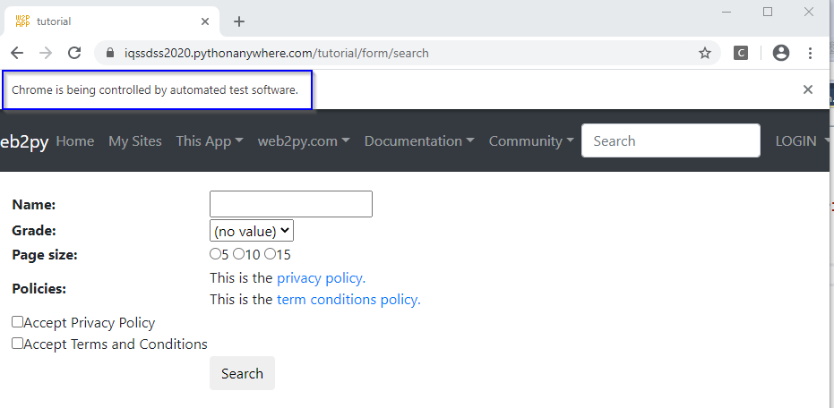
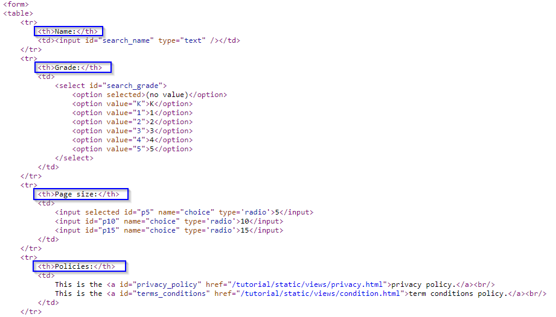

# Finding Web Elements
Selenium works by automating browsers to load the website, retrieve the required data, and even take certain actions on the website. Here, we walk through a practical use-case, using Selenium to extract data from a website.

## Setting up
For the successful implementation of browser automation using Selenium, the software `WebDriver` needs to be set up. The name `WebDriver` is generic --- there are versions of `WebDriver` for all major browsers. We will now go through the steps to set up `WebDriver` for Google Chrome, which is called `ChromeDriver`. Other major browsers have similar steps:  

1.	Install Selenium using a third-party installer such as `pip` to install it from the command line via this command: `pip install selenium`.       
2.	Download the latest stable release of `ChromeDriver` from this [website](https://chromedriver.chromium.org/downloads), selecting the appropriate version for your operating system.         
3.	Unzip the downloaded `chromedriver*.zip` file. An application file named `chromedriver.exe` should appear. It is recommended that we place the `.exe` file on the main folder containing the codes.         

Now that we have completed the setup steps, we can proceed. We have created this [dynamic complete search form webpage](https://iqssdss2020.pythonanywhere.com/tutorial/form/search) to run our scraper against. We can start by loading the example page. 

To begin with, we import `WebDriver` from Selenium and set a path to `chromedriver.exe`. Selenium does not contain its own web browser; it requires integration with third party browsers to run. The `selenium.webdriver` is used to implement various browsers, in this case, Google Chrome. The `webdriver.Chrome()` method is provided with the path of `chromedriver.exe` so that it creates an object of the `selenium.webdriver.chrome.webdriver.WebDriver` class, called "driver" in this case, which will now provide access to the various attributes and properties from `WebDriver`. The exectuable `chromedriver.exe` will be instantiated at this instance or upon creation of the driver object. The Terminal screen and an empty new window of Google Chrome will now be loaded. 


```python
from selenium import webdriver

driver = webdriver.Chrome('YOUR_PATH_TO_chromedriver.exe_FILE')
```

The new window from Google Chrome is then provided with a URL using the `get()` function from `WebDriver`. The `get()` method accepts the URL that is to be loaded on the browser. We provide our example website address as an argument to `get()`. Then the browser will start loading the URL:


```python
form_url = "https://iqssdss2020.pythonanywhere.com/tutorial/form/search"
driver.get(form_url)
```

 This can be seen in the following screenshot:



As we can see above, a notice is displayed just below the address bar with the message **"Chrome is being controlled by automated test software"**. This message also confirms the successful execution of the `selenium.webdriver` activity, and it can be provided with additional code to act on or automate the page that has been loaded.

Following successful execution of the code, it is recommended that we close and quit the driver to free up system resources. The `close()` method terminates the loaded browser window. The `quit()` method ends the `WebDriver` application.


```python
driver.close()
driver.quit()
```

## Locating web elements
After the new Google Chrome window is loaded with the URL provided, we can find the elements that we need to act on. We first need to find the selector or locator information for those elements of interest. The easiest way to identify the information is to `Inspect` pages using developer tools. Place the cursor anywhere on the webpage, right-click to open a pop-up menu, then select the `Inspect` option. In the `Elements` window, move the cursor over the DOM structure of the page until it reaches the desired element. We then need to find information such as what HTML tag is used for the element, the defined attribute, and the values for the attributes and the structure of the page. 

Next, we need to tell Selenium how to find a particular element or set of elements on a web page programmatically and simulate user actions on these elements. We just need to pass the information we identify in the first step to Selenium. Selenium provides various `find_element_by` methods to find an element based on its attribute/value criteria or selector value that we supply in our script. If a matching element is found, an instance of `WebElement` is returned or the `NoSuchElementException` exception is thrown if Selenium is not able to find any element matching the search criteria. Selenium also provides various `find_elements_by` methods to locate multiple elements. These methods search and return a list of elements that match the supplied values.

Here, we will provide an overview of the various `find_element_by_*` and `find_elements_by_*` methods, with some examples of their use.

*   `find_element_by_id()` and `find_elements_by_id()` methods:   
Return an element or a set of elements that have matching ID attribute values. The `find_elements_by_id()` method returns all the elements that have the same ID attribute values. Let's try finding the search button from the example website. Here is the HTML code for the search button with an ID attribute value defined as `search`. We can find this code if we `Inspect` the site and reach this element in its DOM.

    ```
    <input type="submit" id="search" value="Search" name="q" class="button" />
    ```
    
    Here is an example that uses the `find_element_by_id()` method to find the search button. We will pass the ID attribute's value, `search`, to the `find_element_by_id()` method:
    
    
    ```python
    search_button = driver.find_element_by_id("search")
    ```

*   `find_element_by_name()` and `find_elements_by_name()` methods:   
Return element(s) that have matching name attribute value(s). The `find_elements_by_name()` method returns all the elements that have the same name attribute values. Using the previous example, we can instead find the search button using its name attribute value instead of the ID attribute value in the following way:

    
    ```python
    search_button = driver.find_element_by_name("q")
    ```

*   `find_element_by_class_name()` and `find_elements_by_class_name()` methods:   
Return element(s) that have matching class attribute value(s). The `find_elements_by_class_name()` method returns all the elements that have the identical class name attribute values. Using the previous example, we can instead find the search button using its class attribute value in following way:

    
    ```python
    search_button = driver.find_element_by_class_name("button")
    ```

*   `find_element_by_tag_name()` and `find_elements_by_tag_name()` methods:   
Find element(s) by their HTML tag name. The example page displays a search form which has several form fields to fill in.  Each form field name is implemented using an `<th>` or table header cell tag inside a `<tr>` or table row tag as shown in the following HTML code:

    

    We will use the `find_elements_by_tag_name()` method to get all the form field names. In this example, we will first find the table body implemented as `<tbody>` using the `find_element_by_tag_name()` method and then get all the `<tr>` or table row elements by calling the `find_elements_by_tag_name()` method on the table body object. For each of the first 4 table rows, we then get its form field name using the `<th>` tag.

    
    ```python
    table = driver.find_element_by_tag_name("tbody")
    entries = table.find_elements_by_tag_name("tr")
    for i in range(4):
        header = entries[i].find_element_by_tag_name("th").text
        print(header)
    ```

*   `find_element_by_xpath()` and `find_elements_by_xpath()` methods:    
Return element(s) that are found by the specified XPath query. XPath is a query language used to search and locate nodes in a XML document. All major web browsers support XPath. Selenium can leverage and use powerful XPath queries to find elements on a web page. One of the advantages of using XPath is when we can't find a suitable ID, name, or class attribute value for the element. We can use XPath to either find the element in absolute terms or relative to an element that does have an ID or name attribute. We can also use defined attributes other than the ID, name, or class with XPath queries. We can also find elements with the help of a partial check on attribute values using XPath functions such as `starts-with()`, `contains()`, and `ends-with()`. 

    For example, we want to get the second form field name "Grade". This element is defined as a `<th>` tag, but does not have the ID, name, or class attributes defined. Also, we cannot use the `find_element_by_tag_name()` method as there are multiple `<tr>` and `<th>` tags defined on the page. In this case, we can use the `find_element_by_xpath()` method. To find the XPath of this element, we `Inspect` the example site, in the `Elements` window, move the cursor over its DOM structure and find the desired element. We then right-click and choose `copy XPath` from the pop-up menu. We obtain the following XPath of this element:

    ```
    //*[@id="table"]/tbody/tr[2]/th
    ```

    This XPath indicates that the path to our desired element starts from the root and then proceeds to an element with a unique id (`id="table"`) and then continues until it reaches the desired element. Please note that the index of the XPath always starts with 1 rather than 0, unlike those of built-in Python data structures. We then pass this XPath to the `find_element_by_xpath()` method as an argument:

    
    ```python
    second_header = driver.find_element_by_xpath('//*[@id="table"]/tbody/tr[2]/th').text
    ```

    We typically use the XPath method when there exists an element with a unique id on the path to the desired element. Otherwise, this method is not reliable.

*   `find_element_by_css_selector()` and `find_elements_by_css_selector()` methods:    
Return element(s) that are found by the specified CSS selector. CSS is a style sheet language used by web designers to describe the look and feel of a HTML document. CSS is used to define various style classes that can be applied to elements for formatting. CSS selectors are used to find HTML elements based on their attributes such as ID, classes, types, attributes, or values and much more to apply the defined CSS rules. Similar to XPath, Selenium can leverage and use CSS selectors to find elements on a web page.

    In our previous example, in which we wanted to get the search button on the example site, we can use the following selector, where the selector is defined as the element tag along with the class name. This will find an `<input>` element with the `"btn-default"` class name. We then test it by automating a click on the search button object we found and find if it starts the search successfully. 

    
    ```python
    search_button = driver.find_element_by_css_selector("input.btn-default")
    search_button.click()
    ```

*   `find_element_by_link_text()` and `find_elements_by_link_text()` methods:   
Find link(s) using the text displayed for the link. The `find_elements_by_link_text()` method gets all the link elements that have matching link text. For example, we may want to get the `privacy policy link` displayed on the example site. Here is the HTML code for the `privacy policy link` implemented as the `<a>`, or anchor tag, with text `"privacy policy"`:
    
    ```
    This is the <a id="privacy_policy" href="/tutorial/static/views/privacy.html">privacy policy.</a><br/>
    ```

    Let's create a test that locates the `privacy policy link` using its text and check whether it's displayed:
    
    
    ```python
    privacypolicy_link = driver.find_element_by_link_text("privacy policy.")
    privacypolicy_link.click()
    ```

*   `find_element_by_partial_link_text()` and `find_elements_by_partial_link_text()` methods:   
Find link(s) using partial text. For example, on the example site, two links are displayed: one is the `privacy policy link` with `"privacy policy"` as text and the other is the `term conditions policy link` with `"term conditions policy"` as text. Let us use this method to find these links using the `"policy"` text and check whether we have two of these links available on the page:

    
    ```python
    policy_links = driver.find_elements_by_partial_link_text("policy")
    print(len(policy_links))
    ```

## Demo
This section will highlight two use-cases to demonstrate the use of various `find_elements_by` methods. Most often we want to scrape data from tables or article text. The two demos therefore cover these use-cases.  

### Scrape tables
Let's examine this [dynamic table webpage](https://iqssdss2020.pythonanywhere.com/tutorial/default/dynamic). This page uses JavaScript to write a table to a `<div>` element of the page. If we were to scrape this page’s table using traditional methods, we’d only get the loading page, without actually getting the data that we want. Suppose that we want to scrape all cells of this table. The first thing we need to do is to complete the physical setup steps, as detailed in section 4.1. We then proceed to load the example page in our program as shown below. We go through this loading procedure together once more so that you are going to be used to it. 


```python
from selenium import webdriver
import time

driver = webdriver.Chrome('YOUR_PATH_TO_chromedriver.exe_FILE')
table_url = "https://iqssdss2020.pythonanywhere.com/tutorial/default/dynamic"
driver.get(table_url)
time.sleep(2)
```

We need to enforce our program to pause for some time, in this case 2 seconds, after the `get()` function instead of immediately executing the next command because we need to ensure that the webpage has been fully downloaded before executing the next command in the program. 

Before we really start, we have to think about how to store the scraped data in a nice format, like a `.csv` file. We can use the Python file operation methods to achieve this. Here's an implementation of creating a file object to write data to:


```python
file = open('C:\\Users\\JLiu\\Desktop\\Web_Tutorial\\table.csv', "w", encoding = "utf-8")
```

In order to scrape cells, we need to locate them in the DOM structure of the example webpage of a table. If we `Inspect` this page, we can see that the table is defined with a `<tbody>` tag inside a `<table>` tag. Each table row is defined with a `<tr>` tag and there are multiple table rows. So in the program we scrape all the table rows and store them in a list called as "entries".


```python
table_body = driver.find_element_by_xpath('//*[@id="result"]/table/tbody')
entries = table_body.find_elements_by_tag_name('tr')
```


The first table row is the table header row, each of its fields is defined with a `<th>` tag or a header cell tag. So, we loop each cell of this first row and write the data in each cell to a string, separated by a comma and ended with a new line. When the looping is over, we write this string to the .csv file as one row. 


```python
headers = entries[0].find_elements_by_tag_name('th')

table_header = ''
for i in range(len(headers)):
    header = headers[i].text
    if i == len(headers) - 1:
        table_header = table_header + header + "\n"
    else:
        table_header = table_header + header + ","
file.write(table_header)
```

In each of the other table rows, there are multiple data cells and each data cell is defined with a `<td>` tag. We have to find each cell using `find_elements_by` methods and get its data. There is no way to directly scrape the whole table. Given this, the logic naturally is to loop row by row, and in each row, loop cell by cell. So, we need to have a double for loop in our script. 


```python
for i in range(1, len(entries)):
    cols = entries[i].find_elements_by_tag_name('td')
    table_row = ''
    for j in range(len(cols)):
        col = cols[j].text
        if j == len(cols) - 1:
            table_row = table_row + col + "\n"
        else:
            table_row = table_row + col + ","
    file.write(table_row)
```

Finally, we close the driver and the file:


```python
driver.close()
file.close()
```

### Scrape text
Let us examine this [live website of an online article](https://www.federalregister.gov/documents/2013/09/24/2013-21228/affirmative-action-and-nondiscrimination-obligations-of-contractors-and-subcontractors-regarding). The article on this page has many subsections, each of which have multiple paragraphs and even bullet points. Suppose that we want to scrape the whole text of the article. One interesting way to do it is to scrape all the subsections separately first and then concatenate them altogether. The advantage of doing it this way is that we can also get each subsection's text.

Let us `Inspect` this website. Let us move the cursor to the element of its DOM that defines the article content area. Under this `<div>` element, we can see that subsection headers have tag names all starting with `"h"`, paragraphs have a `<p>` tag name, and bullet points parts have a `<ul>` tag name. The elements with these tag names are all parallel with one other, rather than embedded in a hierarchical structure. This design dictates that we should not write a loop in our script to access them, for example, to access each paragraph under a subsection. Another point to note is that here we use a Python dictionary to store each subsection's text. For each key-value pair in this dictionary, the key stores the subsection title, and the value stores its paragraphs of text. So, this is a convenient data structure to use for this use-case. The following program implements our strategy above to scrape the whole text of the article:


```python
# same as the set up chunk of code
...
journalAddress = "https://www.federalregister.gov/documents/2013/09/24/2013-21228/affirmative-action-and-nondiscrimination-obligations-of-contractors-and-subcontractors-regarding"
# same as the set up chunk of code
...
time.sleep(2)

articleObjects = driver.find_elements_by_xpath('//div[@id="fulltext_content_area"]/*')

articleDictionary = dict()
myKey = ""
myValue_total = ""
```

The program above has put all web elements related to the article content into a list called as "articleObjects". Since all of these web elements are in parallel with each other rather than in a nested structure, we simply use one level of for loop to loop each web element on the list and scrape its content into the right place in the dictionary we have created as we loop over this list. If the tag name of a web element on the list starts with "h", then its content should be a subsection title. We scrape its content to a string variable "myKey". If the tag name of a web element on the list starts with "p" or "ul", then its content should be either a paragraph or a set of bullet points under that subsection title. We scrape its content and append it to a string variable "myValue_total". Once we meet with the next subsection title, the program must have appended all paragraphs and bullet points under the current sebsection title and stored them into a string "myValue_total". At this point, we input the key-value pair - the current subsection title as the key and all the paragraphs and bullet points under this subsection title as its value - into the dictionary. After this, we repalce the key, which is the current sebsection title, with the next subsection title, and repeat the above steps.     


```python
for i in range(len(articleObjects)):
    tagName = articleObjects[i].tag_name
    if tagName.startswith("h"):
        if myKey:
            articleDictionary[myKey] = myValue_total
            myKey = ""
            myValue_total = ""
        myKey = articleObjects[i].get_attribute("innerText")
    if tagName.startswith("p"):
        myValue = articleObjects[i].get_attribute("innerText")
        myValue_total = myValue_total + myValue
    if tagName.startswith("ul"):
        myBullets = articleObjects[i].find_elements_by_tag_name('li')
        for j in range(len(myBullets)):
            myBullet = myBullets[j].get_attribute("innerText")
            myValue_total = myValue_total + myBullet
driver.close()
```

After the loop is done, we have scraped all the subsections separately and stored them into a dictionary. Finally, we just need to loop each key-value pair on this dictionary and concatenate their contents altogether as we loop over the dictionary.  


```python
article = ''
for key, value in articleDictionary.items():
    article = article + key + '\n\n' + value + '\n\n***************\n\n'
print(article)
```

## `NoSuchElementException` 
When a web element is not found, it throws the `NoSuchElementException`. The reason for `NoSuchElementException` can be any of the following:

* The way of locating a web element we have adopted doesn't identify any element in the HTML DOM.
* The way of locating a web element we have adopted doesn't uniquely identify the desired element in the HTML DOM and currently finds some other hidden / invisible element.    
* The way of locating a web element we have adopted is unable to identify the desired element as it is not within the browser's `Viewport`.   
* The way of locating a web element we have adopted identifies the element but is invisible due to presence of the attribute `style="display: none;"`.  
* The `WebElement` we are trying to locate is within an `<iframe>` tag.    
* The `WebDriver` instance is looking out for the `WebElement` even before the element is present/visibile within the HTML DOM.    

The solution to address the `NoSuchElementException` can be either of the following:

1.   When the element we locate does not exist in the DOM, use `try-except` event handler to avoid the termination of the program:  


```python
from selenium.common.exceptions import NoSuchElementException

try:
    elem = driver.find_element_by_xpath("element_xpath")
    elem.click()
except NoSuchElementException:
    pass
```

This solution is to address the inconsistency in the DOM among the seemingly same pages.

2.   When the page loads, for some reason we may be taken to the bottom of the page, but the element we need to scrape is on the top of the page and thus is out of view. In this situation, we can locate the element in the DOM first, then use the `execute_script()` method to scroll the element into view: 


```python
elem = driver.find_element_by_xpath("element_xpath")
driver.execute_script("arguments[0].scrollIntoView();", elem)
```

3.   In case the element has the attribute `style="display: none;"`, remove the attribute through `execute_script()` method:


```python
elem = driver.find_element_by_xpath("element_xpath")
driver.execute_script("arguments[0].removeAttribute('style')", elem)
elem.send_keys("text_to_send")
```

4.   Adopt a way of locating a web element which uniquely identifies the desired `WebElement`. The preferable method is `find_elements_by_id()`, since the id attribute uniquely identifies a web element. 


5.   To check if the element is within an `<iframe>`, traverse up the HTML to locate the respective `<iframe>` tag and use the `switch_to()` method to shift to the desired iframe through any of the following approaches:


```python
driver.switch_to.frame("iframe_name")
driver.switch_to.frame("iframe_id")
driver.switch_to.frame(1) // 1 represents frame index
```

We can switch back to the main frame by using one of the following methods:
    

```python
driver.switch_to.default_content()
driver.switch_to.parent_frame()
```

A better way to switch frames would be to induce `WebDriverWait()` for the availability of the intended frame with `expected_conditions` set to `frame_to_be_available_and_switch_to_it` as in the following examples:
    

```python
WebDriverWait(driver, 10).until(EC.frame_to_be_available_and_switch_to_it(By.ID,"id_of_iframe")) // through Frame ID
WebDriverWait(driver, 10).until(EC.frame_to_be_available_and_switch_to_it(By.NAME,"name_of_iframe")) // through Frame name
WebDriverWait(driver, 10).until(EC.frame_to_be_available_and_switch_to_it(By.XPATH,"xpath_of_iframe")) // through Frame XPath

WebDriverWait(driver, 10).until(EC.frame_to_be_available_and_switch_to_it(By.CSS_SELECTOR,"css_of_iframe")) // through Frame CSS
```

6.   If the element is not present/visible in the HTML DOM immediately, induce `WebDriverWait` with `expected_conditions` set to the proper method as follows:

+   To wait for `presence_of_element_located`:   


```python
element = WebDriverWait(driver, 20).until(expected_conditions.presence_of_element_located((By.XPATH, "element_xpath']")))
```

+	To wait for `visibility_of_element_located`:


```python
element = WebDriverWait(driver, 20).until(expected_conditions.visibility_of_element_located((By.CSS_SELECTOR, "element_css")))
```

+	To wait for `element_to_be_clickable`: 


```python
element = WebDriverWait(driver, 20).until(expected_conditions.element_to_be_clickable((By.LINK_TEXT, "element_link_text")))
```


