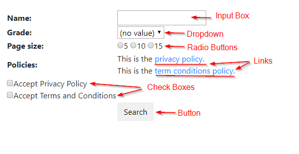
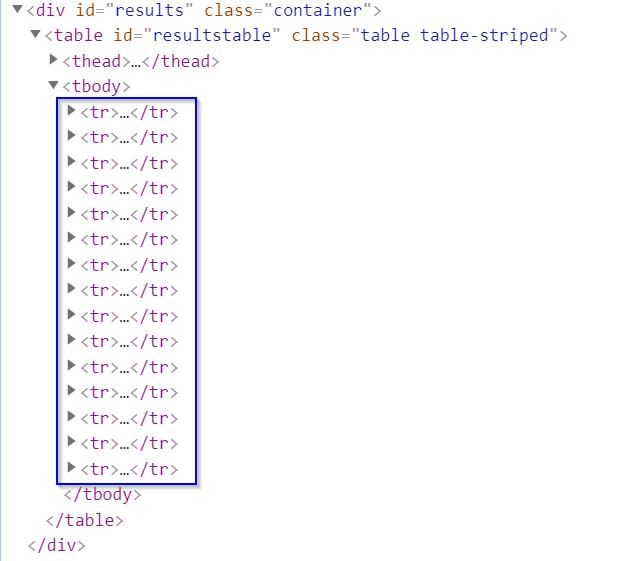

# Filling in Web Forms
You must have noticed the ubiquity of web forms while surfing the internet. A web form comprises web elements such as input boxes, check boxes, radio buttons, links, drop down menus, and submit buttons to collect user data. To process web forms, we need to first find these web elements and then take subsequent actions on them like selecting a value or entering some text. Selenium has an API that helps us to do that. Since we have covered how to find web element(s) using Selenium selectors in the previous chapter, this chapter focuses on accessing forms in Selenium: performing actions on and interacting with the forms. Let us see how different actions can be performed on each type of web field that may be involved in your web form. We use this [example login form website](https://iqssdss2020.pythonanywhere.com/tutorial/form/search) to illustrate most of the examples used in this chapter. Below is a screenshot of how this website uses forms:  



## Input box
The input box is the text box that displays user input. To handle any input box, we must be able to enter information, clear information or get information from the box. To enter text into a textbox we can use the `send_keys()` method, which would input the user required text from our automation script. The following code enters the student name starting with "A" into a text box whose ID is "search_name":


```python
driver.find_element_by_id('search_name').send_keys("A")
```

To clear pre-entered text we can use the `clear()` method. For example:


```python
driver.find_element_by_id('search_name').clear()
```

If we need to validate some existing text, we can fetch text already in a text box using the `get_attribute()` method:


```python
nameText = driver.find_element_by_id('search_name').get_attribute("value")
print(nameText)
```

## Check box
A check box is a small box that enables us to check or uncheck it. To select or check a value we use the `click()` method. It simply changes the state from unchecked to checked and vice-versa. For example, the code below clicks on the `Accept Privacy Policy` checkbox:


```python
driver.find_element_by_id('privacypolicy').click()
```

Dealing with checkboxes is not always so straightforward. We may need to select a checkbox only when it is not selected already. Or, we may want to deselect a checkbox only when it is already selected. If we are trying to select a checkbox, but we perform a click operation on an already selected checkbox, then the checkbox will be deselected; something we do not want to happen. So, we first need to validate whether the checkbox is selected or not. To get the current state of the checkbox we can use one of two methods: `is_selected()` or `get_attribute("checked")`. For example, using `is_selected()`:


```python
privacy_boolean = driver.find_element_by_id('privacypolicy').is_selected()
print(privacy_boolean)
print(type(privacy_boolean))
```

This will return a boolean value. This means if the checkbox is checked we would get a `True` value else we will get `False` value. Alternatively, using `get_attribute("checked")`:


```python
privacy_other = driver.find_element_by_id('privacypolicy').get_attribute("checked")
print(privacy_other)
print(type(privacy_other))
```

This will return `True` if the checkbox is selected, but will return `NoneType` if the checkbox is not selected. The following code shows how to deselect a checkbox only when it is selected:


```python
driver.find_element_by_id('privacypolicy').click()
```

## Radio button
A radio button is a circular element on the screen that we can select. It is similar to a checkbox only difference being if we are given multiple radio buttons, we can select just one, while in the case of multiple checkboxes, we can opt multiple of them. The actions performed on the radio button are similar to those on a checkbox and we can use the same methods as above to select a radio button or validate its status of selection: `click()` and `is_selected()` / `get_attribute(“checked”)`. The code below provides an example:


```python
driver.find_element_by_id('p5').click()
pageSize_5_boolean = driver.find_element_by_id('p5').is_selected()
print(pageSize_5_boolean)
print(type(pageSize_5_boolean))

pageSize_5_other = driver.find_element_by_id('p5').get_attribute("checked")
print(pageSize_5_other)
print(type(pageSize_5_other))
```

Radio button does not support deselection. To deselect a radio button, one needs to select any other radio button in that group. If you select the same radio button trying to deselect it, you will get the same selection as before; nothing will change. The following code shows how to deselect a radio button only when it is selected:


```python
driver.find_element_by_id('p10').click()
```

## Link
A link redirects us to a new web page or a new window pop-up or a similar thing. We can use two mechanisms to navigate to a new screen or a new pop up or a new form: we can either do a click action on a link element we find, or get the new URL from the link element we find and then navigate to it. Here is an example of operating the link embedded in the example webpage using the first mechanism:


```python
driver.find_element_by_id("privacy_policy").click()
```

Links are generally embedded in the link element we find with a `<a>` tag name as the **"href"** property. Instead of directly clicking on the link, we can use the `get_attribute()` method. Here is the same example using the second mechanism:


```python
privacy_object = driver.find_element_by_id("privacy_policy")
privacy_link = privacy_object.get_attribute("href")
driver.get(privacy_link)
```

## Dropdown
Dropdown is a list which has an arrow at the rightmost end to expand and show the values. It provides a list of options to the user thereby giving access to one or multiple values as per the requirement. To work with a dropdown, first you need to select or find the main element group and then go inside further and select the sub-element that you want to select for. Selenium Python API provides the `Select` class, which allows you to select the element of your choice. Note that the `Select` class only works with tags which have `<select>` tags. We can select a sub-element using (1) the Index of Dropdown, (2) the Value of Dropdown, or (3) the Text of Dropdown.

If the dropdown has an **“index”** attribute, then we can use that index to select a particular option. You need to be careful while using this way, because it is not un-common to have the index start at 0. We can use the `select_by_index()` method to select an option using the **"index"** attribute. For example, we want to select the 5th grade students:


```python
grade_dropdown = Select(driver.find_element_by_id("search_grade"))
grade_dropdown.select_by_index(6)
```

If the html mark-up defines an `<option>` tag, then you can use the value matching the argument. Suppose the html for dropdown is like this:

```
<td>
    <select id="search_grade">
        <option selected>(no value)</option>
        <option value="K">K</option>
        <option value="1">1</option>
        <option value="2">2</option>
        <option value="3">3</option>
        <option value="4">4</option>
        <option value="5">5</option>
    </select>
</td>
```

We can use the `select_by_value()` method to select an option using the `"value"` attribute.


```python
grade_dropdown.select_by_value("5")
```

Probably the easiest way of doing it is to select an element using text of dropdown. You have to match the text which is displayed in the drop down using the `select_by_visible_text()` method. For example:


```python
grade_dropdown.select_by_visible_text("5")
```

In a similar way we can deselect any selected value from the dropdown using any of the below options: (1) `deselect_by_index()`, (2) `deselect_by_value()`, and (3) `deselect_by_visible_text()`. These methods can be used only when you make multiple selections. The `deselect_all()` method clears all the selected options. This is also only applicable in case of multiple selections. If you try to use this in case of single selection, this will throw a *NotImplementedError* exception.

There are times while performing Selenium automation of our web app, where we need to validate the options coming in our dropdown list. The `Select` class provides property methods that allow us to do it. The first two property methods are applicable wherein we can select multiple options.

*   .all_selected_options - Get the list of all the selected options.   
*   .first_selected_option - Return the first option that has been selected from the dropdown and unlike the above method it would return a single web element and not a list.   
*   .is_multiple - Return True if the dropdown allows multi-selection and return NoneType otherwise.    
*   .options - Get a list of all available options in a dropdown.   

## Buttons

Buttons are simply used to submit whatever information we have filled in our forms to the server. This can be done through click actions on the button, mostly using the `click()` method:


```python
driver.find_element_by_id("search").click()
```

## Demos
I will first show you a simple program that handles all the types of form elements we have covered so far altogether using our [example site](https://iqssdss2020.pythonanywhere.com/tutorial/form/search). Second, using our [example site](https://iqssdss2020.pythonanywhere.com/tutorial/form/search), I will show you an advanced program that handles the situation where you will need to access this form not once but many times sequentially.

### Fill in the Form Just Once
Suppose that we want to search all the 5th grade students whose names start with “A” and page size set at 5. The program below shows you how to fill in the form and submit it to the server:


```python
from selenium import webdriver
from selenium.webdriver.support.select import Select

driver = webdriver.Chrome('C:\\Users\\JLiu\\Desktop\\Web_Tutorial\\chromedriver.exe')
form_url = "https://iqssdss2020.pythonanywhere.com/tutorial/form/search"
driver.get(form_url)
driver.find_element_by_id('search_name').send_keys("A")
Select(driver.find_element_by_id("search_grade")).select_by_visible_text("5")
driver.find_element_by_id('p5').click()
driver.find_element_by_id("privacypolicy").click()
driver.find_element_by_id("termsconditions").click()
driver.find_element_by_id("search").click()
```

### Fill in the Form Many Times
Now suppose that we want to search all the students. This will require us to fill in the form many times, each time with changing input. We have to first play with the website to see if the form webpage will be refreshed every time you access to it. This will determine how we are going to code it. If the form page is refreshed every time you access to the form, then you have to refill in all the form fields each time even if most of those fields are repetitive inputs. The program below shows an example of this case:


```python
from selenium import webdriver
import time
import string
import pandas as pd

driver = webdriver.Chrome('C:\\Users\\JLiu\\Desktop\\Web_Tutorial\\chromedriver.exe')
searchAddress = "https://iqssdss2020.pythonanywhere.com/tutorial/form/search"
driver.get(searchAddress)
time.sleep(2)

students = list()

for letter in string.ascii_uppercase:
    for grade in range(2,8):
        driver.find_element_by_xpath('//*[@id="search_name"]').send_keys(letter)
        driver.find_element_by_xpath('//*[@id="search_grade"]/option[{}]'.format(grade)).click()
        driver.find_element_by_id('p5').click()
        driver.find_element_by_id("privacypolicy").click()
        driver.find_element_by_id("termsconditions").click()
        driver.find_element_by_xpath('//*[@id="search"]').click()
        time.sleep(5)
        try:
            while True:
                table = driver.find_element_by_xpath('//*[@id="results"]/table')
                entries = table.find_elements_by_tag_name("tr")
                for i in range(1, len(entries)):
                    student_dict = dict()
                    cols = entries[i].find_elements_by_tag_name("td")
                    student_dict["name"] = cols[0].text
                    student_dict["grade"] = cols[1].text
                    student_dict["gpa"] = cols[2].text
                    students.append(student_dict)

                try:
                    driver.find_element_by_xpath('//*[@id="next"]').click()
                    time.sleep(2)
                except:
                    break
            driver.get(searchAddress)
            time.sleep(2)
        except:
            print("No results for letter {} at grade {}".format(letter, grade - 2))
            driver.get(searchAddress)
            time.sleep(2)

students_df = pd.DataFrame.from_records(students)
print(students_df)
driver.close()
```

Line 39 and 43 of this program (`driver.get(searchAddress)`) tells us that the form will be refreshed whenever we finish the current search. It could be either when we find out that there is no result for this search or when we have scraped the results for this search. Since the form is refreshed every time for a new search, we need to refill the form every time when a new search starts. This is why lines 15 to 19 of the code which execute the form filling actions are put in the most inner layer of loop. 

Another question is that when the form is refreshed for a new search, how could we know where the search has gone so far at this point? We must know this so that we can know what we will input for the new search. We control the moving of rounds of search by using the indexing of a list. We put all the options for a form field into a created list with the exact order of the list elements as that being displayed in the form field. When we loop this list, we can control where the search has run through. In this example, line 13 and 14 play this role. They control the indexing of the name list and the grade list. The name field and the grade field are the only two fields whose input values will change for a new search. This is why we need to create a list for them and then loop over it rather than doing the same thing for all the other form fields.  

Another scenario is that the form page is not refreshed for a new search. In this case, then we do not need to refill in the form fields that will not change their values in a new search. Below is the program that performs the same task – search all students – but in the situation that the form is not refreshed:


```python
from selenium import webdriver
import time
import string
import pandas as pd

driver = webdriver.Chrome('C:\\Users\\JLiu\\Desktop\\Web_Tutorial\\chromedriver.exe')
searchAddress = "https://iqssdss2020.pythonanywhere.com/tutorial/form/search"
driver.get(searchAddress)
time.sleep(2)

students = list()

driver.find_element_by_id('p5').click()
driver.find_element_by_id("privacypolicy").click()
driver.find_element_by_id("termsconditions").click()

for letter in string.ascii_uppercase:
    driver.find_element_by_xpath('//*[@id="search_name"]').clear()
    driver.find_element_by_xpath('//*[@id="search_name"]').send_keys(letter)
    for grade in range(2,8):
        driver.find_element_by_xpath('//*[@id="search_grade"]/option[{}]'.format(grade)).click()
        driver.find_element_by_xpath('//*[@id="search"]').click()
        time.sleep(5)
        try:
            while True:
                table = driver.find_element_by_xpath('//*[@id="results"]/table')
                entries = table.find_elements_by_tag_name("tr")
                for i in range(1, len(entries)):
                    student_dict = dict()
                    cols = entries[i].find_elements_by_tag_name("td")
                    student_dict["name"] = cols[0].text
                    student_dict["grade"] = cols[1].text
                    student_dict["gpa"] = cols[2].text
                    students.append(student_dict)

                try:
                    driver.find_element_by_xpath('//*[@id="next"]').click()
                    time.sleep(2)
                except:
                    break
        except:
            print("No results for letter {} at grade {}".format(letter, grade - 2))
            
students_df = pd.DataFrame.from_records(students)
print(students_df)
driver.close()
```

We cannot find the lines of code in the program that refresh the form page. We put the lines of code that fill in the constant form fields outside of the loop so that those constant fields will not be refilled in every time for a new search. The change of the positions of lines 13 – 15 and line 19 of the code comparing the program in the first scenario reflects this idea.  

## `ElementNotInteractableException`
In some cases when the element is not interactable, actions on it as introduced in the above sections do not work and you are likely to encounter an `ElementNotInteractableException`. This is caused when an element is found, but you cannot interact with it. For instance, you may not be able to click or send keys. There could be several reasons for this:

1.  The element is not visible / not displayed.   
2.  The element is off screen.   
3.  The element is behind another element or hidden.   
4.  Some other action needs to be performed by the user first to enable it.   

There are strategies that may work to make it interactable, depending on the circumstance. 

### Wait until the element is clickable 
If the element has not been fully downloaded yet, we can wait until the element is visible / clickable. Look at the following example in which we want to get the profile for the 5th grade student named as “Adams”. 


```python
from selenium import webdriver
from selenium.webdriver.support.select import Select

driver = webdriver.Chrome('C:\\Users\\JLiu\\Desktop\\Web_Tutorial\\chromedriver.exe')
form_url = "https://iqssdss2020.pythonanywhere.com/tutorial/form/search"
driver.get(form_url)
driver.find_element_by_id('search_name').send_keys("A")
Select(driver.find_element_by_id("search_grade")).select_by_visible_text("5")
driver.find_element_by_id('p5').click()
driver.find_element_by_id("privacypolicy").click()
driver.find_element_by_id("termsconditions").click()
driver.find_element_by_id("search").click()
table = driver.find_element_by_xpath('//*[@id="results"]/table')
entries = table.find_elements_by_tag_name("tr")
fields = entries[1].find_elements_by_tag_name('td')
fields[3].find_element_by_tag_name("a").click()
```

This code produces an error message that `“no such element: Unable to locate element”` because the result table has not been fully downloaded yet. Selenium WebDriver provides two types of waits to handle it – explicit and implicit wait. The `time.sleep()` method is an **explicit wait to set the condition to be an exact time period to wait**, as the code below shows:


```python
from selenium import webdriver
from selenium.webdriver.support.select import Select
import time

driver = webdriver.Chrome('C:\\Users\\JLiu\\Desktop\\Web_Tutorial\\chromedriver.exe')
form_url = "https://iqssdss2020.pythonanywhere.com/tutorial/form/search"
driver.get(form_url)
driver.find_element_by_id('search_name').send_keys("A")
Select(driver.find_element_by_id("search_grade")).select_by_visible_text("5")
driver.find_element_by_id('p5').click()
driver.find_element_by_id("privacypolicy").click()
driver.find_element_by_id("termsconditions").click()
driver.find_element_by_id("search").click()
time.sleep(3)
table = driver.find_element_by_xpath('//*[@id="results"]/table')
entries = table.find_elements_by_tag_name("tr")
fields = entries[1].find_elements_by_tag_name('td')
fields[3].find_element_by_tag_name("a").click()
```

As discussed in the previous chapter, a more efficient solution would be to make WebDriver **wait only as long as required**. This is also an **explicit wait** but more efficient than `time.sleep()`. The code below uses the presence of the resulting table element with id “resulttable” to declare that the page has been fully loaded:


```python
from selenium import webdriver
from selenium.webdriver.support.select import Select
from selenium.webdriver.common.by import By
from selenium.webdriver.support.ui import WebDriverWait
from selenium.webdriver.support import expected_conditions as EC

driver = webdriver.Chrome('C:\\Users\\JLiu\\Desktop\\Web_Tutorial\\chromedriver.exe')
form_url = "https://iqssdss2020.pythonanywhere.com/tutorial/form/search"
driver.get(form_url)
driver.find_element_by_id('search_name').send_keys("A")
Select(driver.find_element_by_id("search_grade")).select_by_visible_text("5")
driver.find_element_by_id('p5').click()
driver.find_element_by_id("privacypolicy").click()
driver.find_element_by_id("termsconditions").click()
driver.find_element_by_id("search").click()
table = WebDriverWait(driver, 10).until(EC.presence_of_element_located((By.ID, "resulttable")))
entries = table.find_elements_by_tag_name("tr")
fields = entries[1].find_elements_by_tag_name('td')
fields[3].find_element_by_tag_name("a").click()
```

The final solution is to use an **implicit wait**, which tells WebDriver to poll the DOM for a certain amount of time when trying to find any element (or elements) not immediately available. The default setting is 0. **Once set, the implicit wait is set for the life of the WebDriver object**. 


```python
from selenium import webdriver
from selenium.webdriver.support.select import Select

driver = webdriver.Chrome('C:\\Users\\JLiu\\Desktop\\Web_Tutorial\\chromedriver.exe')
driver.implicitly_wait(10)
form_url = "https://iqssdss2020.pythonanywhere.com/tutorial/form/search"
driver.get(form_url)
driver.find_element_by_id('search_name').send_keys("A")
Select(driver.find_element_by_id("search_grade")).select_by_visible_text("5")
driver.find_element_by_id('p5').click()
driver.find_element_by_id("privacypolicy").click()
driver.find_element_by_id("termsconditions").click()
driver.find_element_by_id("search").click()
table = driver.find_element_by_xpath('//*[@id="results"]/table')
entries = table.find_elements_by_tag_name("tr")
fields = entries[1].find_elements_by_tag_name('td')
fields[3].find_element_by_tag_name("a").click()
```

### Scroll until the element is on-screen  
An element is on screen means that this element is embedded in the DOM structure of the web page. You can find its DOM structure when inspecting a web page. If the element you act upon is not in the DOM structure, then you will get some kind of error message due to this reason. Let us look at this [example website](https://iqssdss2020.pythonanywhere.com/tutorial/casesLoad/search). Suppose that we search all the 5th grade students whose name starts with "A". If we inspect it, we can find that there are 15 table entries included under the `<tbody>` tag in its DOM structure, as shown in the following figure. 



Suppose that we want to get the profile for student “Aiden” – the 15th record of the page. It will work fine. But if we want to get the profile for the 16th student of the page, we will get an error message saying that “list index out of range”. This is because that record is off-screen. 


```python
from selenium import webdriver
from selenium.webdriver.support.select import Select
import time

driver = webdriver.Chrome('C:\\Users\\JLiu\\Desktop\\Web_Tutorial\\chromedriver.exe')
form_url = "https://iqssdss2020.pythonanywhere.com/tutorial/casesLoad/search"
driver.get(form_url)
driver.find_element_by_id('search_name').send_keys("A")
Select(driver.find_element_by_id("search_grade")).select_by_visible_text("5")
driver.find_element_by_id("search").click()
time.sleep(5)
table = driver.find_element_by_xpath('//*[@id="results"]/table')
table_body = table.find_element_by_tag_name("tbody")
entries = table_body.find_elements_by_tag_name("tr")
fields = entries[15].find_elements_by_tag_name('td')
fields[3].find_element_by_tag_name('a').click()
```

The solution is that we can scroll down the page so that the off-screen records can be added into its DOM structure. You can use the following code to scroll down to a certain height of the page, where “5000” is the height, or use it to scroll down to the bottom of the page:


```python
from selenium import webdriver
from selenium.webdriver.support.select import Select
import time

driver = webdriver.Chrome('C:\\Users\\JLiu\\Desktop\\Web_Tutorial\\chromedriver.exe')
form_url = "https://iqssdss2020.pythonanywhere.com/tutorial/casesLoad/search"
driver.get(form_url)
driver.find_element_by_id('search_name').send_keys("A")
Select(driver.find_element_by_id("search_grade")).select_by_visible_text("5")
driver.find_element_by_id("search").click()
time.sleep(5)
# scroll to a certain height
driver.execute_script("window.scrollTo(0, 5000)") 
# scroll to the bottom
#driver.execute_script("window.scrollTo(0, document.body.scrollHeight);") 
time.sleep(5)
table = driver.find_element_by_xpath('//*[@id="results"]/table')
table_body = table.find_element_by_tag_name("tbody")
entries = table_body.find_elements_by_tag_name("tr")
fields = entries[15].find_elements_by_tag_name('td')
fields[3].find_element_by_tag_name('a').click()
```

### Execute JavaScript to interact directly with the DOM
On this [example website](https://iqssdss2020.pythonanywhere.com/tutorial/formhidden/search), we can see that the form submit button is hidden. If we still use the button `click()` method, we will get an error message saying that “element not interactable”. In this case, you can opt to execute JavaScript that directly interacts with the DOM:


```python
from selenium import webdriver
from selenium.webdriver.support.select import Select

driver = webdriver.Chrome('C:\\Users\\JLiu\\Desktop\\Web_Tutorial\\chromedriver.exe')
driver.implicitly_wait(10)
form_url = "https://iqssdss2020.pythonanywhere.com/tutorial/formhidden/search"
driver.get(form_url)
driver.find_element_by_id('search_name').send_keys("A")
Select(driver.find_element_by_id("search_grade")).select_by_visible_text("5")
driver.find_element_by_id('p5').click()
driver.find_element_by_id("privacypolicy").click()
driver.find_element_by_id("termsconditions").click()
driver.execute_script(f'document.getElementById("search").click();')
table = driver.find_element_by_xpath('//*[@id="results"]/table')
entries = table.find_elements_by_tag_name("tr")
fields = entries[1].find_elements_by_tag_name('td')
fields[3].find_element_by_tag_name('a').click()
```

### Perform whatever other action is necessary
Let us again search for all the 5th grade students whose name starts with “A” on this [example website](https://iqssdss2020.pythonanywhere.com/tutorial/form/search). If you move your mouse over a student name, you will see a hover box showing up above the name. Suppose that we want to scrape the data on the hover box. The hover box is not actionable unless we mover the mouse to a student name to enable it. Once we do that, if you inspect the webpage, you will see the hover box element has been added to its DOM structure. So, we can scrape the data on the hover box from there. The following is the code example that scrapes the content on the hover box of student “Adams”:


```python
from selenium import webdriver
from selenium.webdriver.support.select import Select
from selenium.webdriver.common.action_chains import ActionChains

driver = webdriver.Chrome('C:\\Users\\JLiu\\Desktop\\Web_Tutorial\\chromedriver.exe')
driver.implicitly_wait(10)
form_url = "https://iqssdss2020.pythonanywhere.com/tutorial/form/search"
driver.get(form_url)
driver.find_element_by_id('search_name').send_keys("A")
Select(driver.find_element_by_id("search_grade")).select_by_visible_text("5")
driver.find_element_by_id('p5').click()
driver.find_element_by_id("privacypolicy").click()
driver.find_element_by_id("termsconditions").click()
driver.find_element_by_id("search").click()
table = driver.find_element_by_xpath('//*[@id="results"]/table')
entries = table.find_elements_by_tag_name("tr")
fields = entries[1].find_elements_by_tag_name('td')
name_tag = fields[0].find_element_by_tag_name("span")
hov = ActionChains(driver).move_to_element(name_tag)
hov.perform()
hov_id = name_tag.get_attribute("aria-describedby")
print(hov_id)
hov_text = driver.find_element_by_id(hov_id).text
print(hov_text)
```

We first need to import `ActionChains` class in Selenium WebDriver. We create an ActionChains object by passing driver object. We then find the student name “Adams” object in the page and move cursor on this object using the method `move_to_element()`. Method `perform()` is used to execute the actions that we have built on the ActionChains object. In this case, this action makes the hover box appear above the student name. Once this is done, the hover box element is added to the DOM structure of the page. By inspecting this new addition in the DOM structure, we can find the ID of the hover box through attribute **“aria-describedby”** and therefore scrape the content of the hover box object associated with that ID.   

