# When to Use Selenium Driver?
The Selenium driver is particularly used to scrape data from dynamic websites that use JavaScript (although it can scrape data from static websites too). The use of JavaScript can vary from simple form events to single page apps that download all their content after loading. The consequence of this is that for many web pages the content that is displayed in our web browser is not available in the original HTML. For example, the result table shows up only after the user click the search box, the content following a click on a link is generated instantaneously rather than already being stored on the server before the click, or a JavaScript request might trigger a new block of content to load. The following subsections of this part cover those three examples in detail. This tutorial will cover the scraping techniques that use Python Selenium package capable of executing the JavaScript itself, and scrape the website as you view it in your browser. 

## An Example of Dynamic Search
Let us look at an example dynamic web page, which is available at [Dynamic Search](https://iqssdss2020.pythonanywhere.com/tutorial/cases/search). This example website has a search form that is used to locate students. Let us say we want to find all the students whose name begins with the letter A and who are in the fifth grade:

| **Figure I-1.1** |
|:--:|
|  |

We place the mouse anywhere on this webpage. We right-click the mouse and click **inspect** from the menu to inspect the results. In the **Elements** window, we would find that the results are stored within a `<div>` element with `ID “results”`:

| **Figure I-1.2** |
|:--:|
| 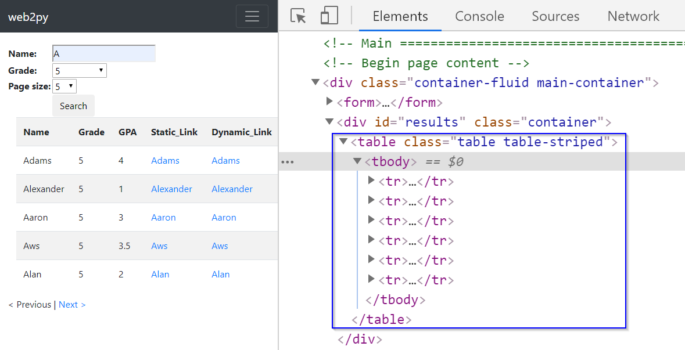 |

Let us try to scrape the information from the result table using the lxml module, which was also covered in detail in the Python Web-Scraping Workshop. 


```python
from lxml import html
import requests

search_url = "https://iqssdss2020.pythonanywhere.com/tutorial/cases/search"
search_page = requests.get(search_url)
search_html = html.fromstring(search_page.text)
firstEntry_link = search_html.xpath('//*[@id="results"]/table')
print(firstEntry_link)
```

```
## []
```

The example scraper here has failed to extract results since the `xpath()` method returns an empty list. Examining the source code of this web page can help you understand why. Let us put the mouse anywhere on this webpage. Right-click the mouse and click **View page source** from the menu to examine the source code. Here, we find that the `<div>` element with `ID “results”` is empty. 

| **Figure I-1.3** |
|:--:|
|  |

If we scroll down the source code a little bit, we can find that the display of the result table is coded in a JavaScript function called as `displayResult(jsonresult)` in the JavaScript section. This means that the web page has used JavaScript to load the search results dynamically. At this point, you could recognize that **page source code** is the original HTML you get when you make a request to the server without executing JavaScript code.  In contrast, the **Elements** window has the HTML that has been revised via running the JavaScript section code.  

| **Figure I-1.4** |
|:--:|
|  |

## An Example of Dynamic Link
Let us now examine what a dynamic link is, and how it is different from a static link. When you click on a link, if it is a static link, the content that appears comes from a file that has been stored on the server before the click. If it is a dynamic link, then the content that appears is generated instantaneously after the click by executing a JavaScript function. Then let us take a further look about how different a dynamic link is from a static link. Let us still **inspect** the result table in the **Elements** window.  

Look at the two links highlighted in **Figure I-2.1**. These two links have a tag name `<a>` with an attribute `href`. The first link is a static link, while the second is a dynamic link. 

| **Figure I-2.1** |
|:--:|
|  |

Normally, if a link is a static link, its link address will end with a file name with a file extension. In this case, the link address (*https://iqssdss2020.pythonanywhere.com/tutorial/static/views/Adrian.html*) ends with a **.html** file. The link address is formed first starting with a server address (*https://iqssdss2020.pythonanywhere.com*) and followed by the web application name (*/tutorial*) and then followed by a hierarchical path of folders to that **.html** file. 

| **Figure I-2.2** |
|:--:|
| 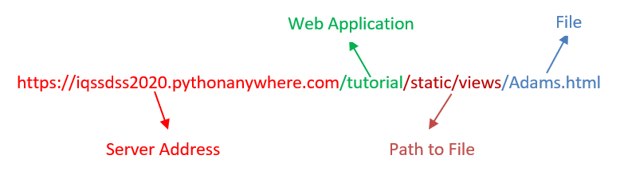 |

On the other hand, if a link is a dynamic link, you will not find a file extension at the end of its link address. For example, in this case, the link address (*https://iqssdss2020.pythonanywhere.com/tutorial/cases/getstudent/Adams*) has no a file extension at the end. It is formed first beginning at a server address (*https://iqssdss2020.pythonanywhere.com*) and followed by the web application name (*/tutorial*) and then followed by the name of the Python script (*cases.py*) in the web application (*/cases*) that calls a function in this script called as `getstudent()` (*/getstudent*) followed with a parameter value (*/Adams*) to the `getstudent()` function.

| **Figure I-2.3** |
|:--:|
| 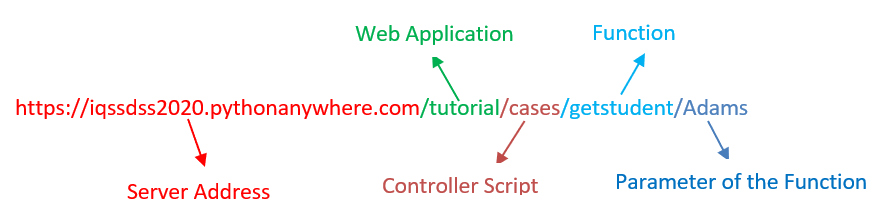 |  

Suppose that we temporarily disable the JavaScript execution functionality in our browser by changing the browser’s settings. Let us copy the static link address and open it in a new browser. We should be able to see the profile of the chosen student as **Figure 1-2.4** shows. But if we copy the dynamic link address and open it in a new browser, we will only see an empty webpage with just page layout as **Figure 1-2.5** shows. This is because the new browser whose JavaScript functionality has been disabled cannot execute JavaScript code in order to display the profile content.  

| **Figure I-2.4** |
|:--:|
| 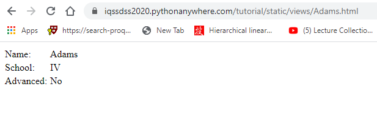 |  

| **Figure I-2.5** |
|:--:|
| 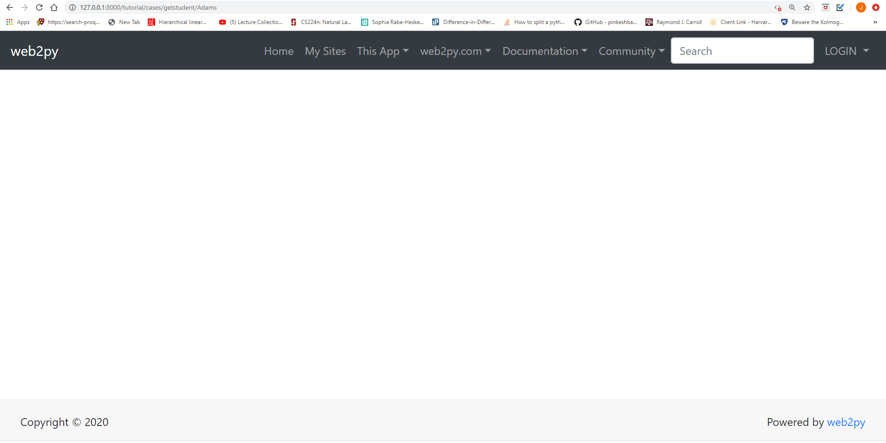 |

We can also see this difference using the requests module, which was also covered in detail in the Python Web-Scraping Workshop. 


```python
staticLink_url = "https://iqssdss2020.pythonanywhere.com/tutorial/static/views/Adams.html"
staticLink_page = requests.get(staticLink_url)
staticLink_html = html.fromstring(staticLink_page.text)
html.open_in_browser(staticLink_html, encoding = 'UTF-8')

dynamicLink_url = "https://iqssdss2020.pythonanywhere.com/tutorial/cases/getstudent/Adams"
dynamicLink_page = requests.get(dynamicLink_url)
dynamicLink_html = html.fromstring(dynamicLink_page.text)
html.open_in_browser(dynamicLink_html, encoding = 'UTF-8')
```

The requests module cannot execute JavaScript code. As the code above illustrates, it behaves the same as a browser whose JavaScript functionality is disabled.  

Examining the source code of the chosen student’s profile web page of both the static and dynamic links can help you further understand why. The source code of the profile web page of a static link shows a complete html file without a JavaScript section. 

| **Figure I-2.6** |
|:--:|
| 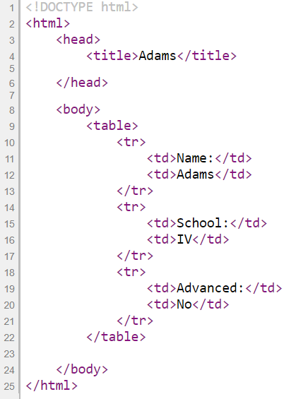 |

In the source code of the profile web page of a dynamic link, we find that the `<div>` element with `ID “results”` is empty. There is a JavaScript section next to it. We can find that in this section there is a JavaScript page load function. This function makes a request to the server for the chosen student’s profile. The server then returns the information to the function. If successful, this function then displays the profile. This means that the web page has used JavaScript to load the chosen student’s profile dynamically. 

| **Figure I-2.7** |
|:--:|
| 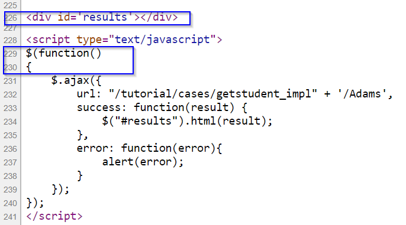 |

## An Example of Dynamic New Load
The dynamic load means that the new content appears only after a JavaScript request for that information is made to the server. There are two major ways in web application design to make a JavaScript request in order to trigger a new block of content to load. The first way uses pagination, and the second way scrolls bar to the bottom of a page. 

Let us first look at pagination. Let us **inspect** the web page of dynamic search again. We would find that the page links are stored within a `<div>` element with `ID “pagination”`. Here, the `href` attribute has a value of `javascript:void(0)`. It just means the browser stays at the same position on the same page and does nothing. Once the page links are clicked, the browser will execute a JavaScript function `previous()` / `next()` to make another JavaScript request to the server for the information on that page and then display those new information coming from the server on the previous or next page via executing the relevant JavaScript functions.

| **Figure I-3.1** |
|:--:|
| 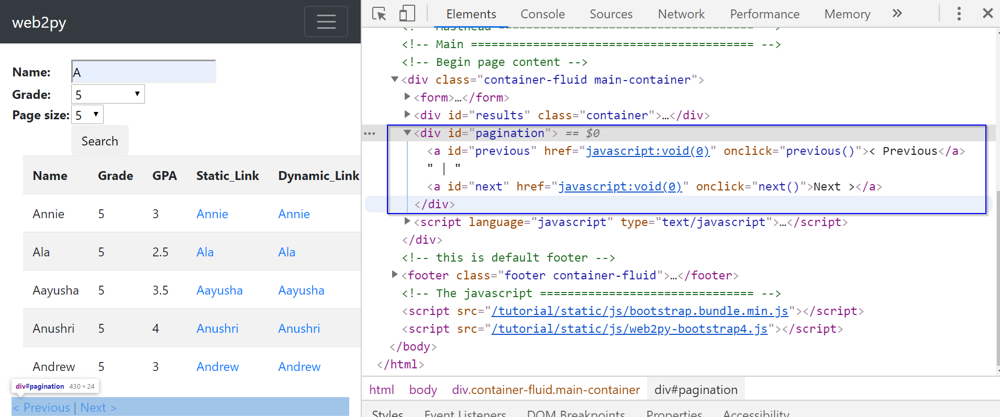 |

In this case, the value of the `href` attribute is not an URL (The Uniform Resource Locator). So, there is no point to try to test if this is a static or dynamic link using the requests module as what we do in **Section I-2**. But we can illustrate the dynamic load using the lxml module. The code below tries to scrape the page link information using the lxml module. The scraper here has failed to extract the page links since the `xpath()` method returns an empty list. 


```python
search_url = "https://iqssdss2020.pythonanywhere.com/tutorial/cases/search"
search_page = requests.get(search_url)
search_html = html.fromstring(search_page.text)
page_link = search_html.xpath('//*[@id="next"]')
print(page_link)
```

```
## []
```

Let us examine the **page source code** to see why. Here, we find that the `<div>` element with `ID “pagination”` is empty. If we scroll down the source code to the end, we can find that the display of the page links is coded in a JavaScript function `displayResult(jsonresult)` in the JavaScript section. This means that the web page has used JavaScript to load the page links and insert it at the position of the `<div>` element with `ID “pagination”` in the original HTML. We could see the revised HTML after running the JavaScript code in the **Elements** window. 

| **Figure I-3.2** |
|:--:|
| 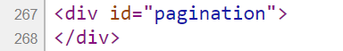 |

| **Figure I-3.3** |
|:--:|
| 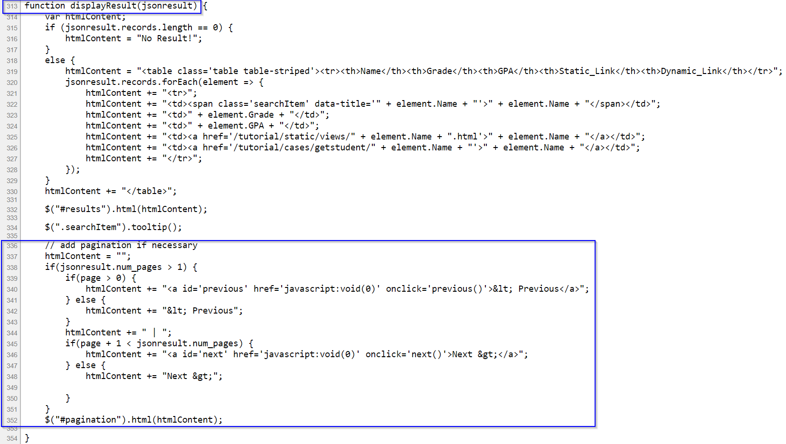 |

Now let us examine the second way of design – scroll down to the bottom of page – to load the new content. Let us look at another example web page, which is available at [dynamic search load](https://iqssdss2020.pythonanywhere.com/tutorial/casesLoad/search). This webpage is the same as the previous example webpage except it uses scrolling bar down instead of clicking page link to load the new content. The code below tries to scrap the information of the result table’s entries using the lxml module. The scraper here has failed to extract those information since the `xpath()` method returns an empty list. 


```python
searchLoad_url = "https://iqssdss2020.pythonanywhere.com/tutorial/casesLoad/search"
searchLoad_page = requests.get(searchLoad_url)
searchLoad_html = html.fromstring(searchLoad_page.text)
entries_link = searchLoad_html.xpath('//*[@id="resultstable"]/tbody/tr')
print(page_link)
```

```
## []
```

**Figure I-3.4** illustrates the result table part of code in the original HTML from the **page source code**. **Figure I-3.5** highlights the same part of code in the revised HTML from the **Elements** window after it executes the JavaScript code. It is clear to see that there is no information under the tag name `<tbody>` in **Figure I-3.4**. This explains why the `xpath()` method returns an empty list. In **Figure I-3.5**, the webpage runs the JavaScript to insert the first chunk of the students’ information into the empty result table that has been created statically before running the JavaScript and then display it in the browser.  

| **Figure I-3.4** |
|:--:|
| 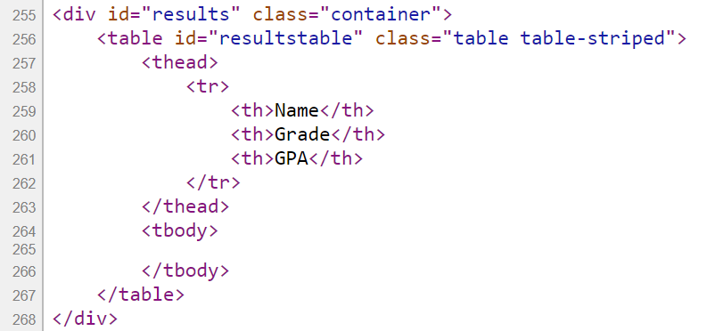 |

| **Figure I-3.5** |
|:--:|
| 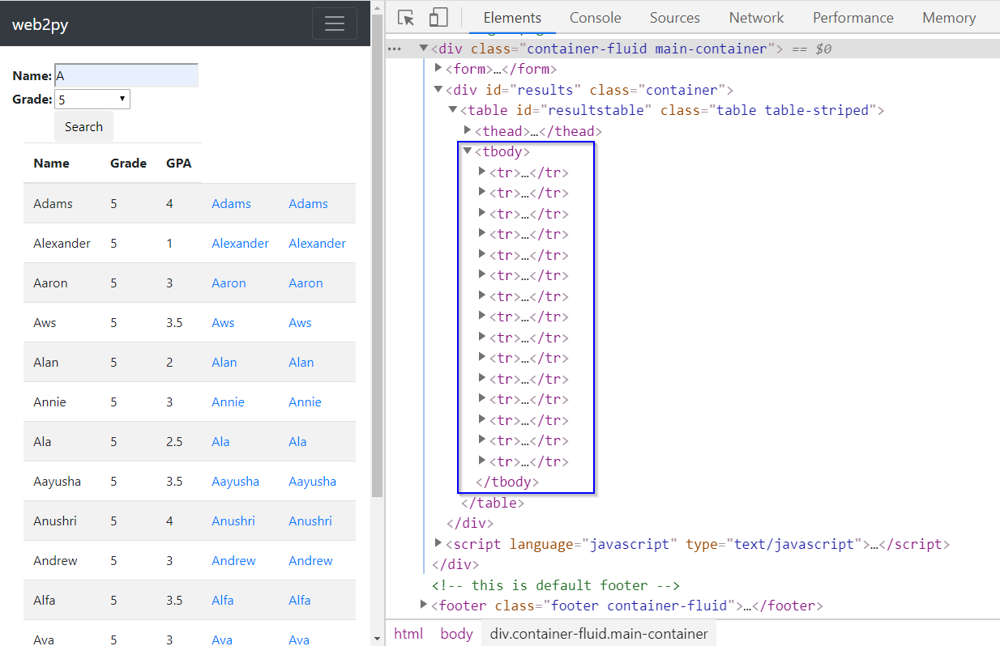 |

More interestingly, once we open the **Elements** window of this example webpage, under the `<tbody>` tag, we find there are 15 table entries (with tag `<tr>`). We can therefore infer that a load has a total of 15 table entries. If we scroll down to the bottom of the webpage, we could see that 9 more entries are appended to the table. If we continue to scroll down to the bottom of the page, nothing is changed. This means that there exists a total of 24 table entries and the new load loads the next 9 new ones after the first batch.  Your browser executes the JavaScript code to perform all these actions. If you look at the JavaScript section in the **page source code**, you will see that a JQuery method `$(window).on("scroll", function()` defines the scrolling down to the bottom of page and triggers the load of the new content once it is satisfied. And another JQuery method `$('#resultstable > tbody:last-child').append(htmlContent)` append the new entries to the result table. Here the screenshot of the relevant parts of the JavaScript code is not shown. 
